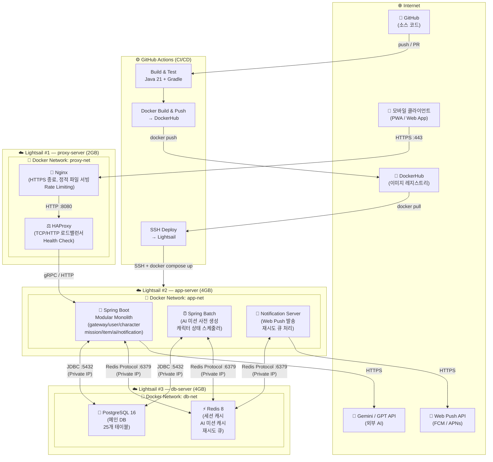
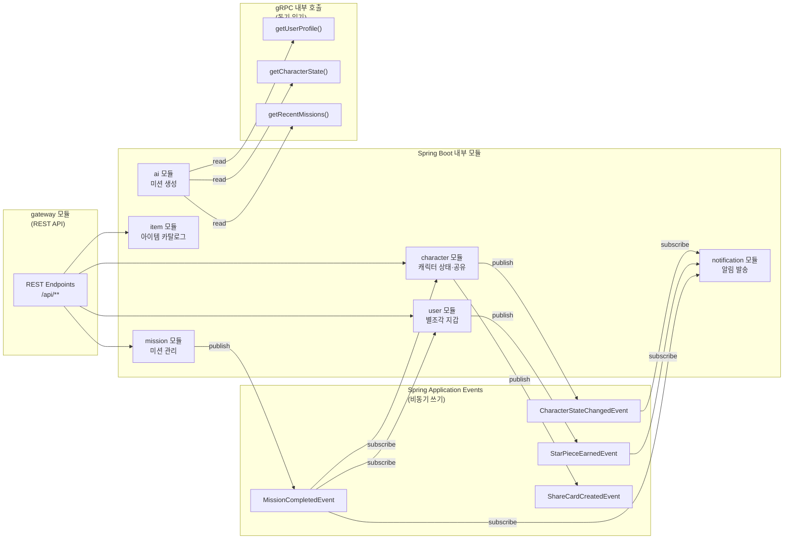
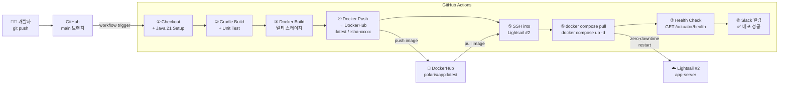
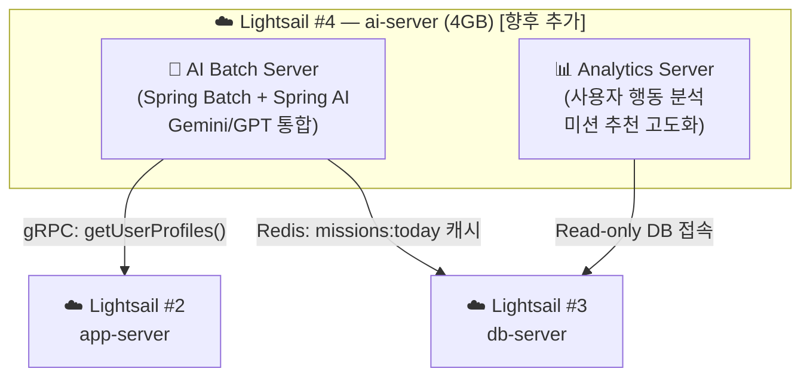

# 08. AWS 인프라 아키텍처 설계

## 문서 정보

| 항목 | 내용 |
|------|------|
| 문서명 | Polaris 인프라 아키텍처 설계서 |
| 작성일 | 2026-05-14 |
| 버전 | v1.0 |
| 상태 | Draft |
| 작성자 | Backend Architecture Team |

---

## 목차

1. [인프라 구성 개요](#1-인프라-구성-개요)
2. [Mermaid 아키텍처 다이어그램](#2-mermaid-아키텍처-다이어그램)
3. [컴포넌트 역할 정의](#3-컴포넌트-역할-정의)
4. [보안 그룹 및 네트워크 구성](#4-보안-그룹-및-네트워크-구성)
5. [예상 월 비용](#5-예상-월-비용)
6. [CI/CD 배포 파이프라인](#6-cicd-배포-파이프라인)
7. [확장 전략 (AI 서버 분리)](#7-확장-전략-ai-서버-분리)
8. [운영 체크리스트](#8-운영-체크리스트)

---

## 1. 인프라 구성 개요

### 1.1 설계 철학

Polaris MVP는 **2주 내 출시, 100명 사용자 확보**를 목표로 하므로 인프라 복잡도를 최소화하면서도 향후 확장이 가능한 구조로 설계합니다.

```
원칙 1: 단순함 우선 — Lightsail 3대로 역할 분리, 과도한 분산 금지
원칙 2: 도커 기반 — 모든 서비스는 컨테이너로 실행, 환경 일관성 확보
원칙 3: Fail-Safe — 각 레이어마다 장애 대비 전략 포함
원칙 4: 비용 최적화 — MVP는 최소 비용, 스케일업 경로 명확하게 정의
```

### 1.2 서버 역할 요약

| 서버 | 별칭 | 주요 역할 | 인스턴스 권장 사양 |
|------|------|----------|-------------------|
| Lightsail #1 | `proxy-server` | Nginx + HAProxy (리버스 프록시, 로드밸런서) | 2GB RAM / 1 vCPU |
| Lightsail #2 | `app-server` | Spring Boot 앱 + 배치 + 알림 서버 | 4GB RAM / 2 vCPU |
| Lightsail #3 | `db-server` | PostgreSQL + Redis | 4GB RAM / 2 vCPU |

---

## 2. Mermaid 아키텍처 다이어그램

### 2.1 전체 시스템 아키텍처



### 2.2 모듈 내부 통신 다이어그램



### 2.3 배포 파이프라인 다이어그램



---

## 3. 컴포넌트 역할 정의

### 3.1 Lightsail #1 — proxy-server

| 컴포넌트 | 역할 한 줄 요약 |
|---------|---------------|
| **Nginx** | HTTPS 인증서 종료(Let's Encrypt), 정적 파일 캐싱, Rate Limiting으로 DDoS 1차 방어 |
| **HAProxy** | 헬스체크 기반 로드밸런싱으로 앱 서버 장애 시 자동 트래픽 차단, 향후 앱 서버 수평 확장 대비 |

> **왜 Nginx와 HAProxy를 함께?**
> Nginx가 HTTPS 종료 + 정적 서빙을 담당하고, HAProxy가 백엔드 앱 서버의 헬스체크 및 연결 관리를 전담하여 역할을 명확히 분리합니다. MVP에서는 앱 서버가 1대지만 HAProxy를 두면 서버를 추가할 때 설정 변경만으로 즉시 확장됩니다.

### 3.2 Lightsail #2 — app-server

| 컴포넌트 | 역할 한 줄 요약 |
|---------|---------------|
| **Spring Boot (Modular Monolith)** | gateway/user/character/mission/item/ai/notification 7개 모듈을 단일 프로세스로 실행, gRPC + Spring Event로 모듈 간 통신 |
| **Spring Batch (배치 서버)** | 매일 새벽 3시 AI 미션 사전 생성, 캐릭터 상태 감소 스케줄러 등 비동기 작업 처리 |
| **Notification Server** | Web Push API 발송, Redis 재시도 큐 소비, 알림 발송 실패 시 지수 백오프 재시도 |

> **왜 배치·알림을 별도 컨테이너로?**
> 동일 Lightsail 인스턴스 안에서 컨테이너만 분리하여 AI 미션 생성 같은 CPU-집중 배치 작업이 앱 서버의 API 응답에 영향을 주지 않도록 격리합니다. 향후 부하가 커지면 컨테이너만 별도 인스턴스로 이동하면 됩니다.

### 3.3 Lightsail #3 — db-server

| 컴포넌트 | 역할 한 줄 요약 |
|---------|---------------|
| **PostgreSQL 16** | 25개 테이블의 메인 데이터 저장소, JSONB 지원으로 미션 컨텍스트·점수 상세 등 반정형 데이터 처리 |
| **Redis 8** | 세션 토큰 캐싱, AI 미션 사전 생성 결과 캐싱(`user:{id}:missions:today`), 알림 재시도 큐, 중복 이벤트 방지 Idempotency Key 저장 |

> **왜 DB 전용 서버를 분리?**
> DB와 앱이 같은 서버에 있으면 앱 배포 재시작 시 DB 커넥션이 끊기는 위험이 있고, 메모리 경합이 발생합니다. 분리 운영으로 앱 무중단 배포와 DB 안정성을 동시에 확보합니다.

### 3.4 GitHub Actions

| 역할 | 한 줄 요약 |
|------|-----------|
| **CI (Build & Test)** | main 브랜치 push 시 Gradle 빌드 + 단위 테스트 자동 실행으로 품질 게이트 역할 |
| **CD (Docker Build & Push)** | 멀티 스테이지 Dockerfile로 경량 이미지 빌드 후 DockerHub에 `:latest` + `:sha-{커밋해시}` 태그로 푸시 |
| **Deploy** | SSH로 Lightsail #2에 접속하여 `docker compose pull && docker compose up -d` 실행, 헬스체크 후 Slack 알림 |

### 3.5 DockerHub

| 역할 | 한 줄 요약 |
|------|-----------|
| **이미지 레지스트리** | CI/CD가 빌드한 이미지를 중앙 저장하고, Lightsail이 배포 시 pull하는 단일 이미지 소스 역할 |

---

## 4. 보안 그룹 및 네트워크 구성

### 4.1 Lightsail 방화벽 규칙 (보안 그룹 대체)

> Lightsail은 VPC Security Group 대신 인스턴스별 방화벽을 사용합니다.

#### proxy-server (#1) 방화벽

| 방향 | 프로토콜 | 포트 | 소스 | 목적 |
|------|---------|------|------|------|
| Inbound | TCP | 80 | 0.0.0.0/0 | HTTP → HTTPS 리다이렉트 |
| Inbound | TCP | 443 | 0.0.0.0/0 | HTTPS 트래픽 수신 |
| Inbound | TCP | 22 | 관리자 IP만 | SSH 접속 |
| Outbound | ALL | ALL | 0.0.0.0/0 | 앱 서버 통신 |

#### app-server (#2) 방화벽

| 방향 | 프로토콜 | 포트 | 소스 | 목적 |
|------|---------|------|------|------|
| Inbound | TCP | 8080 | proxy-server IP만 | HTTP API 수신 |
| Inbound | TCP | 9090 | proxy-server IP만 | gRPC 수신 |
| Inbound | TCP | 22 | 관리자 IP만 | SSH / GitHub Actions Deploy |
| Outbound | TCP | 5432 | db-server IP | PostgreSQL 연결 |
| Outbound | TCP | 6379 | db-server IP | Redis 연결 |
| Outbound | TCP | 443 | 0.0.0.0/0 | 외부 API (Gemini, FCM 등) |

#### db-server (#3) 방화벽

| 방향 | 프로토콜 | 포트 | 소스 | 목적 |
|------|---------|------|------|------|
| Inbound | TCP | 5432 | app-server IP만 | PostgreSQL 접속 허용 |
| Inbound | TCP | 6379 | app-server IP만 | Redis 접속 허용 |
| Inbound | TCP | 22 | 관리자 IP만 | SSH 접속 |
| Outbound | ALL | ALL | — | 기본 아웃바운드 |

### 4.2 네트워크 구성 제안

```
[권장] Lightsail Static IP 설정
  - proxy-server: 퍼블릭 Static IP 1개 할당 (도메인 연결)
  - app-server: 퍼블릭 IP는 SSH 용도만 (보안 그룹으로 제한)
  - db-server: 퍼블릭 IP 불필요 (app-server에서만 접근)

[권장] Lightsail Private IP 활용
  - 같은 리전 내 Lightsail 인스턴스끼리는 Private IP로 통신
  - DB 연결은 반드시 Private IP 사용 (public IP 노출 금지)
  - 설정 예: SPRING_DATASOURCE_URL=jdbc:postgresql://10.x.x.x:5432/polaris

[권장] Docker 내부 네트워크
  - 각 서버 내 컨테이너는 Docker bridge network로 격리
  - proxy-net: nginx ↔ haproxy
  - app-net: app ↔ batch ↔ notification
  - db-net: postgres ↔ redis

[보안 강화] 추가 조치
  - PostgreSQL: pg_hba.conf에서 app-server IP만 허용
  - Redis: requirepass 설정 + bind 127.0.0.1 (Docker 내부만)
  - Nginx: SSL/TLS 1.2+ 강제, HSTS 헤더 추가
  - 앱 서버: Spring Security + JWT (RS256) 사용
  - 환경변수: GitHub Actions Secrets 또는 .env 파일 (git 제외)
```

### 4.3 도메인 및 SSL 구성

```
도메인: polaris.example.com
SSL: Let's Encrypt (Certbot) — Nginx에서 자동 갱신
CDN: (MVP 제외, 향후 CloudFront 고려)

Nginx 설정 핵심:
  - HTTP(80) → HTTPS(443) 자동 리다이렉트
  - /api/** → HAProxy → Spring Boot
  - /static/** → Nginx 직접 서빙
  - Rate Limit: 60 req/min per IP
```

---

## 5. 예상 월 비용

### 5.1 MVP 단계 (프리티어 / 최소 구성)

> Lightsail은 AWS 프리티어 대상이 아니므로 Lightsail 자체 요금제 기준으로 산정합니다.

| 항목 | 사양 | 월 비용 (USD) | 비고 |
|------|------|--------------|------|
| Lightsail #1 (proxy) | 2GB RAM / 1 vCPU / 60GB SSD | $10 | |
| Lightsail #2 (app) | 4GB RAM / 2 vCPU / 80GB SSD | $20 | |
| Lightsail #3 (db) | 4GB RAM / 2 vCPU / 80GB SSD | $20 | |
| Static IP × 2 | proxy + app SSH용 | $0 | 인스턴스 연결 시 무료 |
| 데이터 전송 | 각 인스턴스 3~5TB 포함 | $0 | 포함된 대역폭 내 |
| DockerHub | Free Plan (public 이미지) | $0 | 또는 Private $5 |
| GitHub Actions | Free Plan (2,000분/월) | $0 | MVP 수준 충분 |
| Gemini API | 무료 티어 (60 req/min) | $0 | 초기 트래픽 수준 |
| **합계** | | **$50 ~ $55/월** | |

### 5.2 실서비스 단계 (사용자 1,000명 이상)

| 항목 | 사양 | 월 비용 (USD) | 비고 |
|------|------|--------------|------|
| Lightsail #1 (proxy) | 4GB RAM / 2 vCPU | $20 | |
| Lightsail #2 (app) | 8GB RAM / 4 vCPU | $40 | |
| Lightsail #3 (db) | 8GB RAM / 4 vCPU | $40 | |
| Lightsail #4 (AI/batch) | 4GB RAM / 2 vCPU | $20 | AI 서버 분리 시 |
| DockerHub Pro | Private 이미지 무제한 | $5 | |
| GitHub Actions | Team Plan | $4 | 3,000분/월 |
| Gemini API | 유료 tier | ~$30 | 사용량에 따라 변동 |
| 도메인 + SSL | Route53 + Let's Encrypt | $1 | |
| **합계** | | **$155 ~ $200/월** | AI 분리 포함 |

### 5.3 비용 절감 팁

```
1. Lightsail Snapshot: 월 $0.05/GB — 주 1회 스냅샷으로 백업
2. DockerHub: MVP는 public 이미지로 무료 운영, 이미지 보안 필요 시 Private
3. Gemini API: 새벽 배치 생성으로 낮 시간 API 호출 최소화
4. Redis: 미션 캐시 TTL 24시간 설정으로 DB 조회 절감
5. 로그: 초기에는 CloudWatch 대신 컨테이너 로그 파일로 관리
```

---

## 6. CI/CD 배포 파이프라인

### 6.1 전체 흐름

```
개발자 git push (main 브랜치)
    │
    ▼
GitHub Actions 트리거
    │
    ├─ ① 코드 체크아웃
    ├─ ② Java 21 + Gradle 세팅
    ├─ ③ ./gradlew build test       ← 실패 시 중단, Slack 알림
    ├─ ④ Docker 멀티스테이지 빌드
    │     └─ polaris/app:latest
    │     └─ polaris/app:sha-{커밋}  ← 롤백용
    ├─ ⑤ DockerHub push
    │
    ├─ ⑥ SSH → Lightsail #2
    │     ├─ docker compose pull
    │     ├─ docker compose up -d --no-deps app
    │     └─ (배치/알림 서버는 별도 스케줄로 재시작)
    │
    ├─ ⑦ 헬스체크
    │     └─ GET /actuator/health → 200 확인 (최대 3회 재시도)
    │
    └─ ⑧ Slack 배포 완료 알림 (#deploy 채널)
```

### 6.2 GitHub Actions Workflow 예시

```yaml
# .github/workflows/deploy.yml
name: Build & Deploy

on:
  push:
    branches: [main]

jobs:
  build-and-deploy:
    runs-on: ubuntu-latest

    steps:
      - name: Checkout
        uses: actions/checkout@v4

      - name: Set up Java 21
        uses: actions/setup-java@v4
        with:
          java-version: '21'
          distribution: 'temurin'

      - name: Gradle Build & Test
        run: ./gradlew build test --no-daemon

      - name: Docker Build
        run: |
          docker build \
            -t ${{ secrets.DOCKERHUB_USERNAME }}/polaris-app:latest \
            -t ${{ secrets.DOCKERHUB_USERNAME }}/polaris-app:sha-${{ github.sha }} \
            .

      - name: DockerHub Push
        run: |
          echo "${{ secrets.DOCKERHUB_TOKEN }}" | docker login -u "${{ secrets.DOCKERHUB_USERNAME }}" --password-stdin
          docker push ${{ secrets.DOCKERHUB_USERNAME }}/polaris-app:latest
          docker push ${{ secrets.DOCKERHUB_USERNAME }}/polaris-app:sha-${{ github.sha }}

      - name: Deploy to Lightsail
        uses: appleboy/ssh-action@v1
        with:
          host: ${{ secrets.APP_SERVER_IP }}
          username: ubuntu
          key: ${{ secrets.SSH_PRIVATE_KEY }}
          script: |
            cd /opt/polaris
            docker compose pull app
            docker compose up -d --no-deps app
            sleep 10
            curl -f http://localhost:8080/actuator/health || exit 1

      - name: Slack Notify
        if: always()
        uses: 8398a7/action-slack@v3
        with:
          status: ${{ job.status }}
          fields: repo,message,commit,author
        env:
          SLACK_WEBHOOK_URL: ${{ secrets.SLACK_WEBHOOK_URL }}
```

### 6.3 Docker Compose 구성 예시 (app-server)

```yaml
# /opt/polaris/docker-compose.yml (Lightsail #2)
version: '3.9'

networks:
  app-net:
    driver: bridge

services:
  app:
    image: your-dockerhub/polaris-app:latest
    container_name: polaris-app
    restart: unless-stopped
    networks: [app-net]
    ports:
      - "8080:8080"
      - "9090:9090"   # gRPC
    environment:
      - SPRING_PROFILES_ACTIVE=prod
      - SPRING_DATASOURCE_URL=jdbc:postgresql://${DB_PRIVATE_IP}:5432/polaris
      - SPRING_DATASOURCE_USERNAME=${DB_USER}
      - SPRING_DATASOURCE_PASSWORD=${DB_PASSWORD}
      - SPRING_REDIS_HOST=${DB_PRIVATE_IP}
      - SPRING_REDIS_PORT=6379
      - AI_API_KEY=${GEMINI_API_KEY}
    env_file:
      - .env
    healthcheck:
      test: ["CMD", "curl", "-f", "http://localhost:8080/actuator/health"]
      interval: 30s
      timeout: 10s
      retries: 3

  batch:
    image: your-dockerhub/polaris-batch:latest
    container_name: polaris-batch
    restart: unless-stopped
    networks: [app-net]
    environment:
      - SPRING_PROFILES_ACTIVE=prod,batch
    env_file:
      - .env
    depends_on:
      app:
        condition: service_healthy

  notification:
    image: your-dockerhub/polaris-notification:latest
    container_name: polaris-notification
    restart: unless-stopped
    networks: [app-net]
    environment:
      - SPRING_PROFILES_ACTIVE=prod,notification
    env_file:
      - .env
    depends_on:
      app:
        condition: service_healthy
```

### 6.4 롤백 전략

```
정상 배포:
  latest 태그 → 현재 서비스 중

긴급 롤백 시:
  1. SSH 접속
  2. docker compose stop app
  3. docker pull polaris-app:sha-{이전_커밋_해시}
  4. docker tag polaris-app:sha-{이전} polaris-app:latest
  5. docker compose up -d app

자동 롤백 조건 (GitHub Actions):
  - /actuator/health 3회 실패 시 이전 이미지로 자동 복구
```

---

## 7. 확장 전략 (AI 서버 분리)

### 7.1 AI 서버 분리 트리거 조건

다음 조건 중 하나라도 충족되면 AI 배치 서버를 별도 인스턴스로 분리를 검토합니다.

```
- 사용자 수 > 500명 (AI 미션 생성 API 호출 급증)
- 배치 실행 시 app-server CPU 사용률 > 70% 지속
- AI 미션 생성 지연으로 API P95 > 500ms 초과
- AI 모델 변경으로 GPU 가속 필요 시
```

### 7.2 분리 후 아키텍처



### 7.3 장기 확장 로드맵

| 단계 | 사용자 규모 | 인프라 변화 |
|------|-----------|------------|
| MVP | ~100명 | Lightsail 3대 |
| 성장기 | ~1,000명 | AI 서버 분리 (4대) |
| 확장기 | ~10,000명 | RDS (PostgreSQL 관리형) 전환, ElastiCache 도입 |
| 스케일 | ~100,000명 | ECS Fargate 전환, CDN(CloudFront), ALB 도입 |

---

## 8. 운영 체크리스트

### 8.1 배포 전 체크리스트

```
인프라 준비:
  [ ] Lightsail 인스턴스 3대 생성 및 Static IP 할당
  [ ] 각 인스턴스 방화벽 규칙 설정 (섹션 4.1 기준)
  [ ] Docker + Docker Compose 설치 (Ubuntu 24.04)
  [ ] /opt/polaris 디렉터리 생성 + docker-compose.yml 업로드
  [ ] .env 파일 생성 (DB 비밀번호, API 키 등)
  [ ] PostgreSQL 초기화 (스키마 25개 테이블 생성)
  [ ] Redis requirepass 설정

GitHub 설정:
  [ ] GitHub Actions Secrets 등록
      - DOCKERHUB_USERNAME, DOCKERHUB_TOKEN
      - APP_SERVER_IP, SSH_PRIVATE_KEY
      - DB_PRIVATE_IP, DB_USER, DB_PASSWORD
      - GEMINI_API_KEY, SLACK_WEBHOOK_URL
  [ ] DockerHub 리포지토리 생성 (polaris-app, polaris-batch, polaris-notification)

도메인/SSL:
  [ ] 도메인 DNS → proxy-server Static IP 연결
  [ ] Certbot으로 Let's Encrypt 인증서 발급
  [ ] Nginx 설정 파일 적용 (HTTPS 리다이렉트, Rate Limit)
```

### 8.2 모니터링 (MVP 최소 구성)

```
기본 모니터링 (추가 비용 없음):
  - Spring Boot Actuator: /actuator/health, /actuator/metrics
  - Docker 컨테이너 상태: docker stats (cron으로 5분마다 체크)
  - Lightsail 콘솔: CPU/메모리/네트워크 기본 지표

로그 관리:
  - 앱 로그: /opt/polaris/logs/ (Docker volume mount)
  - 로그 로테이션: logrotate 설정 (7일 보관)
  - 에러 로그: Slack #alert 채널 자동 알림 (Logback + Slack Appender)

장애 대응:
  - DB 백업: Lightsail 스냅샷 주 1회 자동화
  - Redis: appendonly yes + 1시간마다 RDB 스냅샷
  - 긴급 롤백: 섹션 6.4 롤백 절차 수행
```

---

## 부록: 환경변수 목록

| 변수명 | 설명 | 예시 |
|--------|------|------|
| `SPRING_PROFILES_ACTIVE` | 활성 프로파일 | `prod` |
| `SPRING_DATASOURCE_URL` | PostgreSQL JDBC URL | `jdbc:postgresql://10.x.x.x:5432/polaris` |
| `SPRING_DATASOURCE_USERNAME` | DB 사용자 | `polaris_user` |
| `SPRING_DATASOURCE_PASSWORD` | DB 비밀번호 | (Secrets) |
| `SPRING_REDIS_HOST` | Redis 호스트 | `10.x.x.x` |
| `SPRING_REDIS_PASSWORD` | Redis 비밀번호 | (Secrets) |
| `GEMINI_API_KEY` | Gemini API 키 | (Secrets) |
| `JWT_SECRET_KEY` | JWT 서명 키 (RS256) | (Secrets) |
| `GOOGLE_CLIENT_ID` | Google OAuth2 Client ID | (Secrets) |
| `GOOGLE_CLIENT_SECRET` | Google OAuth2 Secret | (Secrets) |
| `FCM_SERVER_KEY` | Firebase Cloud Messaging 키 | (Secrets) |
| `SLACK_WEBHOOK_URL` | 운영 알림 Slack Webhook | (Secrets) |

---

**문서 버전 이력**

| 버전 | 날짜 | 변경 내용 | 작성자 |
|------|------|----------|--------|
| v1.0 | 2026-05-14 | 초안 작성 | Backend Team |