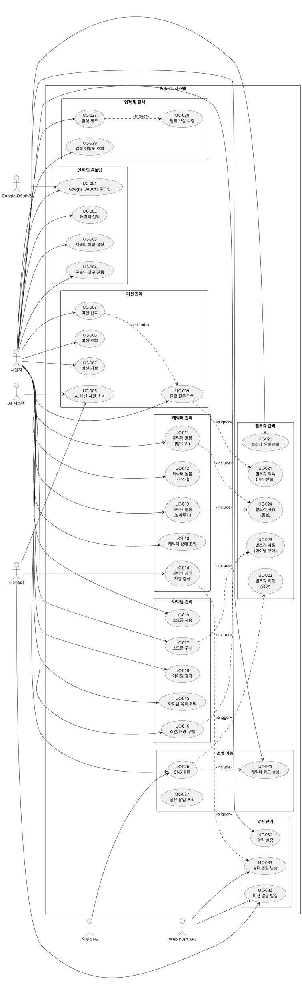

# 유스케이스 명세서

## 📌 문서 정보

| 항목 | 내용 |
|------|------|
| 문서명 | Polaris 유스케이스 명세서 |
| 작성일 | 2026-05-14 |
| 버전 | v1.0 |
| 상태 | Draft |
| 작성자 | Backend Architecture Team |

---

## 1. 액터 정의

### 1.1 주요 액터

| 액터 | 설명 | 역할 |
|------|------|------|
| **사용자** | Polaris 앱을 사용하는 일반 사용자 | 미션 수행, 캐릭터 관리, 아이템 구매 |
| **AI 시스템** | Spring AI 기반 미션 생성 시스템 | 개인화 미션 생성, 캐릭터 말투 변환 |
| **스케줄러** | Spring Scheduler | 미션 사전 생성, 상태 감쇠, 알림 발송 |
| **외부 인증** | Google OAuth2 | 사용자 인증 |
| **Web Push API** | 브라우저 Push 알림 | 알림 발송 |

### 1.2 보조 액터

| 액터 | 설명 |
|------|------|
| **관리자** | 시스템 모니터링 및 운영 담당자 |
| **외부 SNS** | 인스타그램, 트위터 등 공유 대상 플랫폼 |

---

## 2. 유스케이스 목록

### 2.1 인증 및 온보딩

| ID | 유스케이스 | 우선순위 | 페르소나 |
|----|-----------|---------|---------|
| UC-001 | Google OAuth2 로그인 | 🔴 높음 | 전체 |
| UC-002 | 캐릭터 선택 | 🔴 높음 | 전체 |
| UC-003 | 캐릭터 이름 설정 | 🔴 높음 | 전체 |
| UC-004 | 온보딩 설문 진행 | 🔴 높음 | 전체 |

### 2.2 미션 관리

| ID | 유스케이스 | 우선순위 | 페르소나 |
|----|-----------|---------|---------|
| UC-005 | AI 미션 사전 생성 | 🔴 높음 | 전체 |
| UC-006 | 미션 조회 | 🔴 높음 | 전체 |
| UC-007 | 미션 거절 | 🔴 높음 | 지우 |
| UC-008 | 미션 완료 | 🔴 높음 | 전체 |
| UC-009 | 완료 질문 답변 | 🔴 높음 | 전체 |

### 2.3 캐릭터 관리

| ID | 유스케이스 | 우선순위 | 페르소나 |
|----|-----------|---------|---------|
| UC-010 | 캐릭터 상태 조회 | 🔴 높음 | 전체 |
| UC-011 | 캐릭터 돌봄 (밥 주기) | 🟡 중간 | 수진 |
| UC-012 | 캐릭터 돌봄 (재우기) | 🟡 중간 | 수진 |
| UC-013 | 캐릭터 돌봄 (놀아주기) | 🟡 중간 | 수진 |
| UC-014 | 캐릭터 상태 자동 감쇠 | 🔴 높음 | 전체 |

### 2.4 아이템 관리

| ID | 유스케이스 | 우선순위 | 페르소나 |
|----|-----------|---------|---------|
| UC-015 | 아이템 목록 조회 | 🔴 높음 | 민준 |
| UC-016 | 스킨/배경 구매 | 🔴 높음 | 민준 |
| UC-017 | 소모품 구매 | 🟡 중간 | 수진 |
| UC-018 | 아이템 장착 | 🔴 높음 | 민준 |
| UC-019 | 소모품 사용 | 🟡 중간 | 수진 |

### 2.5 별조각 관리

| ID | 유스케이스 | 우선순위 | 페르소나 |
|----|-----------|---------|---------|
| UC-020 | 별조각 잔액 조회 | 🔴 높음 | 전체 |
| UC-021 | 별조각 획득 (미션 완료) | 🔴 높음 | 전체 |
| UC-022 | 별조각 획득 (공유) | 🟡 중간 | 지우 |
| UC-023 | 별조각 사용 (아이템 구매) | 🔴 높음 | 민준 |
| UC-024 | 별조각 사용 (돌봄) | 🟡 중간 | 수진 |

### 2.6 소셜 기능

| ID | 유스케이스 | 우선순위 | 페르소나 |
|----|-----------|---------|---------|
| UC-025 | 캐릭터 카드 생성 | 🔴 높음 | 지우 |
| UC-026 | SNS 공유 | 🔴 높음 | 지우 |
| UC-027 | 공유 유입 추적 | 🟡 중간 | 전체 |

### 2.7 업적 및 출석

| ID | 유스케이스 | 우선순위 | 페르소나 |
|----|-----------|---------|---------|
| UC-028 | 출석 체크 | 🔴 높음 | 수진 |
| UC-029 | 업적 진행도 조회 | 🟡 중간 | 전체 |
| UC-030 | 업적 보상 수령 | 🟡 중간 | 전체 |

### 2.8 알림 관리

| ID | 유스케이스 | 우선순위 | 페르소나 |
|----|-----------|---------|---------|
| UC-031 | 알림 설정 | 🟡 중간 | 민준 |
| UC-032 | 미션 알림 발송 | 🔴 높음 | 전체 |
| UC-033 | 상태 알림 발송 | 🟡 중간 | 수진 |

---

## 3. 유스케이스 상세 명세

## UC-001: Google OAuth2 로그인

- **액터**: 사용자, Google OAuth2
- **사전조건**: 
  - 사용자가 Google 계정을 보유하고 있음
  - 인터넷 연결이 정상임
- **주요 흐름**:
  1. 사용자가 "Google로 로그인" 버튼 클릭
  2. 시스템이 Google OAuth2 인증 페이지로 리다이렉트
  3. 사용자가 Google 계정으로 로그인
  4. Google이 인증 코드 반환
  5. 시스템이 인증 코드로 Access Token 요청
  6. 시스템이 Google User Info API로 사용자 정보 조회
  7. 시스템이 users 테이블에서 사용자 조회
  8. 신규 사용자인 경우 users 테이블에 생성
  9. 시스템이 JWT 토큰 발급
  10. 사용자를 홈 화면으로 이동
- **대체 흐름**:
  - 7a. 기존 사용자인 경우 바로 JWT 발급
- **예외 흐름**:
  - 3a. 사용자가 인증 취소 → 로그인 화면으로 복귀
  - 5a. Google API 장애 → "잠시 후 다시 시도해주세요" 메시지
  - 6a. 네트워크 오류 → 재시도 또는 에러 메시지
- **사후조건**: 
  - 사용자가 인증됨
  - JWT 토큰이 발급됨
  - 신규 사용자인 경우 users 레코드 생성됨
- **관련 기능**: user 모듈, gateway 모듈

---

## UC-002: 캐릭터 선택

- **액터**: 사용자
- **사전조건**: 
  - 사용자가 로그인되어 있음
  - 아직 캐릭터를 선택하지 않음
- **주요 흐름**:
  1. 시스템이 character_types 테이블에서 활성 캐릭터 3종 조회
  2. 시스템이 각 캐릭터의 THUMBNAIL asset 조회
  3. 사용자에게 캐릭터 선택 화면 표시 (노바/무무/쪼리)
  4. 사용자가 캐릭터 하나 선택
  5. 시스템이 선택 정보를 임시 저장 (세션)
  6. 캐릭터 이름 설정 화면으로 이동
- **대체 흐름**:
  - 없음
- **예외 흐름**:
  - 1a. character_types 조회 실패 → 에러 페이지
  - 2a. asset 조회 실패 → 기본 이미지 사용
- **사후조건**: 
  - 캐릭터 타입이 세션에 저장됨
- **관련 기능**: character 모듈, gateway 모듈

---

## UC-003: 캐릭터 이름 설정

- **액터**: 사용자
- **사전조건**: 
  - 사용자가 캐릭터를 선택함
- **주요 흐름**:
  1. 시스템이 이름 입력 화면 표시
  2. 사용자가 캐릭터 이름 입력 (최대 10자)
  3. 시스템이 이름 유효성 검증 (길이, 특수문자)
  4. 시스템이 characters 테이블에 레코드 생성
     - user_id, character_type_id, name, level=1
  5. 시스템이 character_states 테이블에 초기 상태 생성
     - fullness=100, energy=100, affection=50
  6. CharacterCreatedEvent 발행
  7. 온보딩 설문 화면으로 이동
- **대체 흐름**:
  - 없음
- **예외 흐름**:
  - 3a. 이름이 10자 초과 → "10자 이하로 입력해주세요"
  - 3b. 금지어 포함 → "사용할 수 없는 이름입니다"
  - 4a. DB 저장 실패 → 재시도 또는 에러 메시지
- **사후조건**: 
  - characters 레코드 생성됨
  - character_states 레코드 생성됨
  - CharacterCreatedEvent 발행됨
- **관련 기능**: character 모듈

---

## UC-004: 온보딩 설문 진행

- **액터**: 사용자
- **사전조건**: 
  - 사용자가 캐릭터를 생성함
- **주요 흐름**:
  1. 시스템이 설문 질문 9개 조회
  2. 캐릭터 말투로 질문 1개 표시
  3. 사용자가 선택지 중 하나 선택
  4. 시스템이 답변 임시 저장
  5. 다음 질문 표시 (2~9번 반복)
  6. 9개 질문 완료 후 onboarding_surveys 테이블에 저장
  7. OnboardingSurveyCompletedEvent 발행
  8. 홈 화면으로 이동
- **대체 흐름**:
  - 3a. 사용자가 "건너뛰기" 선택 → 기본값으로 저장
- **예외 흐름**:
  - 6a. DB 저장 실패 → 재시도 또는 에러 메시지
- **사후조건**: 
  - onboarding_surveys 레코드 생성됨
  - OnboardingSurveyCompletedEvent 발행됨
  - 사용자가 미션을 받을 수 있는 상태가 됨
- **관련 기능**: user 모듈

---

## UC-005: AI 미션 사전 생성

- **액터**: 스케줄러, AI 시스템
- **사전조건**: 
  - 매일 새벽 3시
  - 활성 사용자가 존재함
- **주요 흐름**:
  1. 스케줄러가 ai 모듈의 미션 생성 작업 트리거
  2. ai 모듈이 user 모듈에 활성 사용자 목록 요청 (gRPC)
  3. 각 사용자별로 병렬 처리 시작
  4. user 모듈에서 설문 답변 조회 (gRPC)
  5. mission 모듈에서 최근 완료/거절 미션 조회 (gRPC)
  6. character 모듈에서 캐릭터 상태 조회 (gRPC)
  7. 컨텍스트 기반 미션 템플릿 필터링 및 점수 계산
  8. Spring AI로 캐릭터 말투 문구 생성 (Gemini/GPT)
  9. Redis에 미션 스택 캐시 저장 (key: user:{id}:missions:today, TTL: 24h)
  10. ai_generation_logs에 생성 이력 저장
- **대체 흐름**:
  - 8a. AI API 응답 3초 초과 → timeout 후 seed 문구 사용
  - 8b. AI API 장애 → seed 문구 사용
- **예외 흐름**:
  - 2a. user 모듈 gRPC 장애 → 해당 사용자 스킵
  - 8a. AI API rate limit → 대기 후 재시도 (최대 3회)
  - 9a. Redis 장애 → DB에 직접 저장
- **사후조건**: 
  - Redis에 사용자별 미션 스택 저장됨
  - ai_generation_logs에 생성 이력 기록됨
- **관련 기능**: ai 모듈, user 모듈, mission 모듈, character 모듈

---

## UC-006: 미션 조회

- **액터**: 사용자
- **사전조건**: 
  - 사용자가 로그인되어 있음
  - 온보딩 설문을 완료함
- **주요 흐름**:
  1. 사용자가 홈 화면 진입
  2. gateway가 mission 모듈에 현재 미션 요청 (gRPC)
  3. mission 모듈이 Redis에서 미션 스택 조회 (key: user:{id}:missions:today)
  4. 미션 스택에서 OFFERED 상태가 아닌 첫 번째 미션 선택
  5. 미션 상태를 OFFERED로 변경
  6. missions 테이블에 저장
  7. 캐릭터 말투 문구와 함께 미션 반환
  8. 사용자에게 미션 카드 표시
- **대체 흐름**:
  - 3a. Redis에 미션 없음 → UC-005 동기 실행 (fallback)
  - 4a. 오늘 제안 가능한 미션 없음 (15개 초과) → "오늘은 충분히 했어요" 메시지
- **예외 흐름**:
  - 2a. mission 모듈 gRPC 장애 → Circuit Breaker 작동, 에러 메시지
  - 3a. Redis 장애 → DB에서 직접 조회
- **사후조건**: 
  - 미션 상태가 OFFERED로 변경됨
  - missions 테이블에 레코드 생성됨
- **관련 기능**: mission 모듈, gateway 모듈

---

## UC-007: 미션 거절

- **액터**: 사용자
- **사전조건**: 
  - 현재 OFFERED 상태의 미션이 있음
- **주요 흐름**:
  1. 사용자가 "다른 미션 보기" 버튼 클릭
  2. 거절 사유 선택 화면 표시
  3. 사용자가 사유 선택 (7가지 중 1개)
  4. gateway가 mission 모듈에 거절 요청 (gRPC)
  5. mission 모듈이 미션 상태를 REJECTED로 변경
  6. mission_interactions 테이블에 거절 이력 저장
  7. MissionRejectedEvent 발행
  8. 캐릭터 반응 메시지 표시 ("괜찮아. 그럼 다른 별 찾아볼게.")
  9. UC-006 실행 (다음 미션 조회)
- **대체 흐름**:
  - 없음
- **예외 흐름**:
  - 4a. 이미 REJECTED 상태 → "이미 거절한 미션입니다"
  - 4b. 오늘 제안 횟수 15개 초과 → "오늘은 충분히 했어요"
- **사후조건**: 
  - 미션 상태가 REJECTED로 변경됨
  - mission_interactions에 거절 이력 저장됨
  - MissionRejectedEvent 발행됨
- **관련 기능**: mission 모듈

---

## UC-008: 미션 완료

- **액터**: 사용자
- **사전조건**: 
  - 현재 OFFERED 상태의 미션이 있음
- **주요 흐름**:
  1. 사용자가 "완료" 버튼 클릭
  2. gateway가 mission 모듈에 완료 시작 요청 (gRPC)
  3. mission 모듈이 미션 상태를 ANSWERING으로 변경
  4. missions 테이블 업데이트
  5. 캐릭터 질문 1개 반환
  6. 사용자에게 질문 화면 표시
  7. UC-009 실행 (완료 질문 답변)
- **대체 흐름**:
  - 없음
- **예외 흐름**:
  - 2a. 이미 COMPLETED 상태 → "이미 완료한 미션입니다"
  - 2b. REJECTED 상태 → "거절한 미션은 완료할 수 없습니다"
- **사후조건**: 
  - 미션 상태가 ANSWERING으로 변경됨
  - missions 테이블 업데이트됨
- **관련 기능**: mission 모듈

---

## UC-009: 완료 질문 답변

- **액터**: 사용자
- **사전조건**: 
  - 미션 상태가 ANSWERING임
- **주요 흐름**:
  1. 사용자가 텍스트 답변 입력 (최대 300자)
  2. gateway가 mission 모듈에 답변 제출 (gRPC)
  3. mission 모듈이 답변 유효성 검증 (최소 1자, 최대 300자)
  4. missions 테이블에 답변 저장
  5. 미션 상태를 COMPLETED로 변경
  6. MissionCompletedEvent 발행 ← **트랜잭션 커밋 후**
  7. user 모듈이 이벤트 구독 → 별조각 지급 (UC-021)
  8. character 모듈이 이벤트 구독 → affection +5
  9. 캐릭터 완료 반응 메시지 표시
  10. 별조각 획득 알림 표시
- **대체 흐름**:
  - 없음
- **예외 흐름**:
  - 3a. 답변이 1자 미만 → "답변을 입력해주세요"
  - 3b. 답변이 300자 초과 → "300자 이하로 입력해주세요"
  - 3c. 욕설 필터 감지 → "적절하지 않은 내용입니다"
  - 6a. 이벤트 발행 실패 → 트랜잭션 롤백
  - 7a. 별조각 지급 실패 → 재시도 큐에 적재
- **사후조건**: 
  - 미션 상태가 COMPLETED로 변경됨
  - missions 테이블에 답변 저장됨
  - MissionCompletedEvent 발행됨
  - 별조각 지급됨
  - 캐릭터 affection 증가됨
- **관련 기능**: mission 모듈, user 모듈, character 모듈

---

## UC-010: 캐릭터 상태 조회

- **액터**: 사용자
- **사전조건**: 
  - 사용자가 캐릭터를 보유함
- **주요 흐름**:
  1. 사용자가 홈 화면 또는 캐릭터 상세 화면 진입
  2. gateway가 character 모듈에 상태 조회 요청 (gRPC)
  3. character 모듈이 character_states 테이블 조회
  4. 현재 시간 기준 상태 감쇠 계산
     - fullness: 6시간마다 -10
     - energy: 8시간마다 -10
     - affection: 24시간마다 -10 (미션/돌봄 없을 시)
  5. 각 상태의 등급 계산 (GOOD/NORMAL/BAD)
  6. character_assets에서 현재 상태에 맞는 이미지 조회
  7. 상태 정보와 이미지 URL 반환
  8. 사용자에게 캐릭터 상태 표시
- **대체 흐름**:
  - 없음
- **예외 흐름**:
  - 2a. character 모듈 gRPC 장애 → 캐시된 상태 표시
  - 6a. asset 조회 실패 → 기본 이미지 사용
- **사후조건**: 
  - 사용자가 캐릭터 상태를 확인함
- **관련 기능**: character 모듈, gateway 모듈

---

## UC-011: 캐릭터 돌봄 (밥 주기)

- **액터**: 사용자
- **사전조건**: 
  - 사용자가 캐릭터를 보유함
  - 별조각 3개 이상 보유 또는 FOOD 아이템 보유
- **주요 흐름**:
  1. 사용자가 "밥 주기" 버튼 클릭
  2. gateway가 character 모듈에 돌봄 요청 (gRPC)
  3. character 모듈이 user 모듈에 별조각 차감 요청 (gRPC)
  4. user 모듈이 star_piece_wallets에서 잔액 확인
  5. 별조각 3개 차감
  6. star_piece_transactions에 거래 내역 저장
  7. character 모듈이 fullness +30 증가
  8. character_states 테이블 업데이트
  9. character_care_logs에 돌봄 이력 저장
  10. CareActionCompletedEvent 발행
  11. 캐릭터 반응 메시지 표시 ("먹는 중... 빛도 맛이 있구나.")
- **대체 흐름**:
  - 3a. FOOD 아이템 사용 선택 → item 모듈에서 수량 차감
- **예외 흐름**:
  - 4a. 별조각 부족 → "별조각이 부족합니다"
  - 5a. 별조각 차감 실패 → 트랜잭션 롤백
  - 7a. fullness가 100 초과 → 100으로 제한
- **사후조건**: 
  - 별조각 3개 차감됨
  - fullness +30 증가됨
  - character_care_logs에 이력 저장됨
  - CareActionCompletedEvent 발행됨
- **관련 기능**: character 모듈, user 모듈

---

## UC-012: 캐릭터 돌봄 (재우기)

- **액터**: 사용자
- **사전조건**: 
  - 사용자가 캐릭터를 보유함
  - 무료 또는 REST 아이템 보유
- **주요 흐름**:
  1. 사용자가 "재우기" 버튼 클릭
  2. gateway가 character 모듈에 돌봄 요청 (gRPC)
  3. character 모듈이 energy +30 증가
  4. character_states 테이블 업데이트
  5. character_care_logs에 돌봄 이력 저장
  6. CareActionCompletedEvent 발행
  7. 캐릭터 반응 메시지 표시 ("나 먼저 잘게. 꿈에서 별 좀 주워올게.")
- **대체 흐름**:
  - 3a. REST 아이템 사용 선택 → item 모듈에서 수량 차감
- **예외 흐름**:
  - 3a. energy가 100 초과 → 100으로 제한
- **사후조건**: 
  - energy +30 증가됨
  - character_care_logs에 이력 저장됨
  - CareActionCompletedEvent 발행됨
- **관련 기능**: character 모듈

---

## UC-013: 캐릭터 돌봄 (놀아주기)

- **액터**: 사용자
- **사전조건**: 
  - 사용자가 캐릭터를 보유함
  - 별조각 2개 이상 보유 또는 TOY 아이템 보유
- **주요 흐름**:
  1. 사용자가 "놀아주기" 버튼 클릭
  2. gateway가 character 모듈에 돌봄 요청 (gRPC)
  3. character 모듈이 user 모듈에 별조각 차감 요청 (gRPC)
  4. user 모듈이 별조각 2개 차감
  5. character 모듈이 affection +25 증가
  6. character_states 테이블 업데이트
  7. character_care_logs에 돌봄 이력 저장
  8. CareActionCompletedEvent 발행
  9. 캐릭터 반응 메시지 표시 ("나 굴러가도 잡아줄 거야?")
- **대체 흐름**:
  - 3a. TOY 아이템 사용 선택 → item 모듈에서 수량 차감
- **예외 흐름**:
  - 4a. 별조각 부족 → "별조각이 부족합니다"
  - 5a. affection이 100 초과 → 100으로 제한
- **사후조건**: 
  - 별조각 2개 차감됨
  - affection +25 증가됨
  - character_care_logs에 이력 저장됨
  - CareActionCompletedEvent 발행됨
- **관련 기능**: character 모듈, user 모듈

---

## UC-014: 캐릭터 상태 자동 감쇠

- **액터**: 스케줄러
- **사전조건**: 
  - 매 시간마다 실행
- **주요 흐름**:
  1. 스케줄러가 character 모듈의 상태 감쇠 작업 트리거
  2. character 모듈이 모든 character_states 조회
  3. 각 캐릭터별로 마지막 업데이트 시간 확인
  4. fullness 감쇠 계산 (6시간마다 -10)
  5. energy 감쇠 계산 (8시간마다 -10)
  6. affection 감쇠 계산 (24시간 미션/돌봄 없으면 -10)
  7. character_states 테이블 업데이트
  8. 상태가 BAD(0~39)로 변경된 경우 CharacterStateChangedEvent 발행
  9. notification 모듈이 이벤트 구독 → 상태 알림 발송 (UC-033)
- **대체 흐름**:
  - 없음
- **예외 흐름**:
  - 7a. DB 업데이트 실패 → 다음 주기에 재시도
- **사후조건**: 
  - 캐릭터 상태가 시간에 따라 감소됨
  - BAD 상태 진입 시 알림 발송됨
- **관련 기능**: character 모듈, notification 모듈

---

## UC-015: 아이템 목록 조회

- **액터**: 사용자
- **사전조건**: 
  - 사용자가 로그인되어 있음
- **주요 흐름**:
  1. 사용자가 상점 탭 클릭
  2. gateway가 item 모듈에 아이템 목록 요청 (gRPC)
  3. item 모듈이 item_catalog 테이블에서 활성 아이템 조회
  4. 아이템을 카테고리별로 그룹화 (SKIN/BACKGROUND/CONSUMABLE)
  5. 각 아이템의 구매 가능 여부 확인
     - SKIN/BACKGROUND: user_items에 이미 있으면 구매 불가
     - CONSUMABLE: 항상 구매 가능
  6. 아이템 목록과 구매 가능 여부 반환
  7. 사용자에게 아이템 목록 표시
- **대체 흐름**:
  - 없음
- **예외 흐름**:
  - 2a. item 모듈 gRPC 장애 → 캐시된 목록 표시
- **사후조건**: 
  - 사용자가 구매 가능한 아이템 목록을 확인함
- **관련 기능**: item 모듈, gateway 모듈

---

## UC-016: 스킨/배경 구매

- **액터**: 사용자
- **사전조건**: 
  - 사용자가 충분한 별조각을 보유함
  - 해당 스킨/배경을 아직 구매하지 않음
- **주요 흐름**:
  1. 사용자가 스킨/배경 아이템 선택
  2. 미리보기 화면 표시
  3. 사용자가 "구매" 버튼 클릭
  4. gateway가 item 모듈에 구매 요청 (gRPC)
  5. item 모듈이 user_items에서 중복 구매 확인
  6. user 모듈에 별조각 차감 요청 (gRPC)
  7. user 모듈이 별조각 차감 및 거래 내역 저장
  8. item 모듈이 user_items에 아이템 추가
  9. ItemPurchasedEvent 발행
  10. 구매 완료 메시지 표시
- **대체 흐름**:
  - 없음
- **예외 흐름**:
  - 5a. 이미 구매한 아이템 → "이미 보유한 아이템입니다"
  - 7a. 별조각 부족 → "별조각이 부족합니다"
  - 7b. 별조각 차감 실패 → 트랜잭션 롤백
- **사후조건**: 
  - 별조각 차감됨
  - user_items에 아이템 추가됨
  - ItemPurchasedEvent 발행됨
- **관련 기능**: item 모듈, user 모듈

---

## UC-017: 소모품 구매

- **액터**: 사용자
- **사전조건**: 
  - 사용자가 충분한 별조각을 보유함
- **주요 흐름**:
  1. 사용자가 소모품 아이템 선택
  2. 구매 수량 선택 (1~10개)
  3. 총 가격 계산 표시
  4. 사용자가 "구매" 버튼 클릭
  5. gateway가 item 모듈에 구매 요청 (gRPC)
  6. user 모듈에 별조각 차감 요청 (gRPC)
  7. user 모듈이 별조각 차감 및 거래 내역 저장
  8. item 모듈이 user_items에서 해당 아이템 조회
  9. 기존 레코드 있으면 quantity 증가, 없으면 신규 생성
  10. ItemPurchasedEvent 발행
  11. 구매 완료 메시지 표시
- **대체 흐름**:
  - 없음
- **예외 흐름**:
  - 7a. 별조각 부족 → "별조각이 부족합니다"
  - 7b. 별조각 차감 실패 → 트랜잭션 롤백
- **사후조건**: 
  - 별조각 차감됨
  - user_items의 quantity 증가됨
  - ItemPurchasedEvent 발행됨
- **관련 기능**: item 모듈, user 모듈

---

## UC-018: 아이템 장착

- **액터**: 사용자
- **사전조건**: 
  - 사용자가 스킨 또는 배경 아이템을 보유함
- **주요 흐름**:
  1. 사용자가 인벤토리 탭 클릭
  2. gateway가 item 모듈에 보유 아이템 목록 요청 (gRPC)
  3. item 모듈이 user_items 조회
  4. 보유 아이템 목록 표시
  5. 사용자가 장착할 아이템 선택
  6. gateway가 item 모듈에 장착 요청 (gRPC)
  7. item 모듈이 user_items의 is_equipped 업데이트
     - 같은 카테고리의 다른 아이템은 is_equipped=false
     - 선택한 아이템은 is_equipped=true
  8. ItemEquippedEvent 발행
  9. character 모듈이 이벤트 구독 → 캐릭터 이미지 갱신
  10. 장착 완료 메시지 표시
- **대체 흐름**:
  - 없음
- **예외 흐름**:
  - 7a. 아이템을 보유하지 않음 → "보유하지 않은 아이템입니다"
- **사후조건**: 
  - user_items의 is_equipped 업데이트됨
  - ItemEquippedEvent 발행됨
  - 캐릭터 이미지 변경됨
- **관련 기능**: item 모듈, character 모듈

---

## UC-019: 소모품 사용

- **액터**: 사용자
- **사전조건**: 
  - 사용자가 소모품 아이템을 보유함 (quantity > 0)
- **주요 흐름**:
  1. 사용자가 캐릭터 상태 화면에서 돌봄 액션 선택
  2. "아이템 사용" 옵션 선택
  3. 보유 소모품 목록 표시
  4. 사용자가 소모품 선택
  5. gateway가 item 모듈에 사용 요청 (gRPC)
  6. item 모듈이 user_items의 quantity -1 감소
  7. quantity가 0이 되면 레코드 삭제
  8. ItemUsedEvent 발행
  9. character 모듈이 이벤트 구독 → 상태 증가
  10. 캐릭터 반응 메시지 표시
- **대체 흐름**:
  - 없음
- **예외 흐름**:
  - 6a. quantity가 0 → "보유한 아이템이 없습니다"
- **사후조건**: 
  - user_items의 quantity 감소됨
  - ItemUsedEvent 발행됨
  - 캐릭터 상태 증가됨
- **관련 기능**: item 모듈, character 모듈

---

## UC-020: 별조각 잔액 조회

- **액터**: 사용자
- **사전조건**: 
  - 사용자가 로그인되어 있음
- **주요 흐름**:
  1. 사용자가 앱 실행 또는 화면 전환
  2. gateway가 user 모듈에 별조각 잔액 요청 (gRPC)
  3. user 모듈이 star_piece_wallets 테이블 조회
  4. 현재 잔액 반환
  5. 화면 상단에 별조각 잔액 표시
- **대체 흐름**:
  - 없음
- **예외 흐름**:
  - 2a. user 모듈 gRPC 장애 → 캐시된 잔액 표시
- **사후조건**: 
  - 사용자가 현재 별조각 잔액을 확인함
- **관련 기능**: user 모듈, gateway 모듈

---

## UC-021: 별조각 획득 (미션 완료)

- **액터**: 사용자, mission 모듈
- **사전조건**: 
  - 미션이 COMPLETED 상태로 변경됨
  - MissionCompletedEvent가 발행됨
- **주요 흐름**:
  1. user 모듈이 MissionCompletedEvent 구독
  2. 이벤트에서 mission_id, user_id, reward_amount 추출
  3. star_piece_wallets에서 사용자 지갑 조회
  4. balance += reward_amount
  5. star_piece_wallets 업데이트
  6. star_piece_transactions에 거래 내역 저장
     - transaction_type: MISSION_REWARD
     - amount: reward_amount
     - mission_id: mission_id
  7. StarPieceEarnedEvent 발행
  8. notification 모듈이 이벤트 구독 → 알림 발송
- **대체 흐름**:
  - 없음
- **예외 흐름**:
  - 3a. 지갑 조회 실패 → 재시도 큐에 적재
  - 5a. 업데이트 실패 → 재시도 큐에 적재
  - 6a. 중복 지급 방지 (mission_id 기준 unique 체크)
- **사후조건**: 
  - 별조각 잔액 증가됨
  - star_piece_transactions에 거래 내역 저장됨
  - StarPieceEarnedEvent 발행됨
- **관련 기능**: user 모듈, mission 모듈, notification 모듈

---

## UC-022: 별조각 획득 (공유)

- **액터**: 사용자
- **사전조건**: 
  - 사용자가 SNS 공유를 완료함
  - 오늘 공유 보상을 받지 않음 (하루 1회 제한)
- **주요 흐름**:
  1. user 모듈이 ShareCompletedEvent 구독
  2. share_events 테이블에서 오늘 공유 보상 수령 여부 확인
  3. 오늘 첫 공유인 경우 별조각 +10 지급
  4. star_piece_wallets 업데이트
  5. star_piece_transactions에 거래 내역 저장
     - transaction_type: SHARE_REWARD
     - amount: 10
  6. share_events에 reward_given=true 업데이트
  7. StarPieceEarnedEvent 발행
  8. 보상 획득 알림 표시
- **대체 흐름**:
  - 2a. 오늘 이미 공유 보상 받음 → 보상 지급 스킵
- **예외 흐름**:
  - 4a. 업데이트 실패 → 재시도 큐에 적재
- **사후조건**: 
  - 별조각 +10 증가됨
  - star_piece_transactions에 거래 내역 저장됨
  - share_events에 reward_given=true 저장됨
- **관련 기능**: user 모듈

---

## UC-023: 별조각 사용 (아이템 구매)

- **액터**: 사용자
- **사전조건**: 
  - 사용자가 아이템 구매를 시도함
  - 충분한 별조각을 보유함
- **주요 흐름**:
  1. item 모듈이 user 모듈에 별조각 차감 요청 (gRPC)
  2. user 모듈이 star_piece_wallets에서 잔액 확인
  3. balance >= item_price 확인
  4. balance -= item_price
  5. star_piece_wallets 업데이트
  6. star_piece_transactions에 거래 내역 저장
     - transaction_type: ITEM_PURCHASE
     - amount: -item_price
     - item_id: item_id
  7. 차감 성공 응답 반환
  8. item 모듈이 아이템 지급 처리
- **대체 흐름**:
  - 없음
- **예외 흐름**:
  - 3a. 잔액 부족 → "별조각이 부족합니다" 에러 반환
  - 5a. 업데이트 실패 → 트랜잭션 롤백
- **사후조건**: 
  - 별조각 차감됨
  - star_piece_transactions에 거래 내역 저장됨
- **관련 기능**: user 모듈, item 모듈

---

## UC-024: 별조각 사용 (돌봄)

- **액터**: 사용자
- **사전조건**: 
  - 사용자가 돌봄 액션을 시도함
  - 충분한 별조각을 보유함
- **주요 흐름**:
  1. character 모듈이 user 모듈에 별조각 차감 요청 (gRPC)
  2. user 모듈이 star_piece_wallets에서 잔액 확인
  3. balance >= care_cost 확인
  4. balance -= care_cost
  5. star_piece_wallets 업데이트
  6. star_piece_transactions에 거래 내역 저장
     - transaction_type: CARE_ACTION
     - amount: -care_cost
  7. 차감 성공 응답 반환
  8. character 모듈이 상태 증가 처리
- **대체 흐름**:
  - 없음
- **예외 흐름**:
  - 3a. 잔액 부족 → "별조각이 부족합니다" 에러 반환
  - 5a. 업데이트 실패 → 트랜잭션 롤백
- **사후조건**: 
  - 별조각 차감됨
  - star_piece_transactions에 거래 내역 저장됨
- **관련 기능**: user 모듈, character 모듈

---

## UC-025: 캐릭터 카드 생성

- **액터**: 사용자
- **사전조건**: 
  - 사용자가 캐릭터를 보유함
- **주요 흐름**:
  1. 사용자가 "공유" 버튼 클릭
  2. gateway가 character 모듈에 캐릭터 카드 생성 요청 (gRPC)
  3. character 모듈이 현재 장착된 스킨/배경 정보 조회
  4. character_assets에서 SHARE_CARD 이미지 조회
  5. user 모듈에 오늘 획득 별조각 요청 (gRPC)
  6. 캐릭터 카드 데이터 생성
     - 캐릭터 이미지
     - 캐릭터 이름
     - 오늘 획득 별조각
     - 캐릭터 대사
  7. 카드 이미지 URL 반환
  8. gateway가 카드 미리보기 화면 표시
  9. 사용자가 "공유하기" 버튼 클릭 → UC-026 실행
- **대체 흐름**:
  - 없음
- **예외 흐름**:
  - 4a. SHARE_CARD asset 없음 → 기본 이미지 사용
- **사후조건**: 
  - 캐릭터 카드가 생성됨
- **관련 기능**: character 모듈, user 모듈, gateway 모듈

---

## UC-026: SNS 공유

- **액터**: 사용자, 외부 SNS
- **사전조건**: 
  - 캐릭터 카드가 생성됨
- **주요 흐름**:
  1. 사용자가 "공유하기" 버튼 클릭
  2. gateway가 character 모듈에 공유 링크 생성 요청 (gRPC)
  3. character 모듈이 공유 링크 생성
     - shareId 생성 (UUID)
     - 링크: https://polaris.app/share/{shareId}
  4. share_events 테이블에 공유 이력 저장
     - user_id, share_id, platform, created_at
  5. 공유 링크와 카드 데이터 반환
  6. gateway가 Web Share API 호출
  7. 사용자가 공유 대상 선택 (인스타그램, 트위터 등)
  8. 공유 완료
  9. character 모듈이 ShareCompletedEvent 발행
  10. user 모듈이 이벤트 구독 → 별조각 지급 (UC-022)
  11. 공유 완료 메시지 표시
- **대체 흐름**:
  - 7a. 사용자가 공유 취소 → 이벤트 발행 안 함
- **예외 흐름**:
  - 6a. Web Share API 미지원 → 링크 복사 기능 제공
  - 4a. DB 저장 실패 → 재시도
- **사후조건**: 
  - share_events에 공유 이력 저장됨
  - ShareCompletedEvent 발행됨
  - 별조각 지급됨 (하루 1회)
- **관련 기능**: character 모듈, user 모듈, gateway 모듈

---

## UC-027: 공유 유입 추적

- **액터**: 신규 사용자
- **사전조건**: 
  - 신규 사용자가 공유 링크를 통해 앱 접속
- **주요 흐름**:
  1. 신규 사용자가 공유 링크 클릭
  2. 랜딩 페이지에서 shareId 추출
  3. shareId를 localStorage에 저장
  4. 신규 사용자가 회원가입 진행
  5. gateway가 localStorage에서 shareId 조회
  6. character 모듈에 공유 유입 추적 요청 (gRPC)
  7. character 모듈이 users 테이블에 referred_by_share_id 저장
  8. share_events에서 shareId로 공유자 조회
  9. 공유자에게 추천 보상 지급
     - 별조각 +50
     - "친구 초대 성공" 업적 진행
  10. 신규 가입자에게 가입 보상 지급
     - 별조각 +30
- **대체 흐름**:
  - 5a. localStorage에 shareId 없음 → 일반 가입으로 처리
- **예외 흐름**:
  - 8a. shareId가 유효하지 않음 → 일반 가입으로 처리
- **사후조건**: 
  - users.referred_by_share_id 저장됨
  - 공유자에게 추천 보상 지급됨
  - 신규 가입자에게 가입 보상 지급됨
- **관련 기능**: character 모듈, user 모듈, gateway 모듈

---

## UC-028: 출석 체크

- **액터**: 사용자
- **사전조건**: 
  - 사용자가 로그인되어 있음
  - 오늘 출석 체크를 하지 않음
- **주요 흐름**:
  1. 사용자가 앱 실행
  2. gateway가 user 모듈에 오늘 출석 여부 확인 (gRPC)
  3. 오늘 출석하지 않은 경우 출석 팝업 표시
  4. 사용자가 "출석하기" 버튼 클릭
  5. gateway가 user 모듈에 출석 요청 (gRPC)
  6. user 모듈이 attendance_logs 테이블에 출석 기록 저장
  7. 연속 출석 일수 계산
  8. 별조각 +3 지급
  9. star_piece_transactions에 거래 내역 저장
  10. AttendanceCheckedEvent 발행
  11. 출석 캘린더에 별 도장 표시
  12. 연속 출석 업적 확인 (7일, 30일 등)
- **대체 흐름**:
  - 2a. 오늘 이미 출석함 → 팝업 표시 안 함
- **예외 흐름**:
  - 6a. 중복 출석 시도 → "이미 출석했습니다"
- **사후조건**: 
  - attendance_logs에 출석 기록 저장됨
  - 별조각 +3 지급됨
  - AttendanceCheckedEvent 발행됨
- **관련 기능**: user 모듈, gateway 모듈

---

## UC-029: 업적 진행도 조회

- **액터**: 사용자
- **사전조건**: 
  - 사용자가 로그인되어 있음
- **주요 흐름**:
  1. 사용자가 업적 탭 클릭
  2. gateway가 user 모듈에 업적 목록 요청 (gRPC)
  3. user 모듈이 achievements 테이블에서 모든 업적 조회
  4. user_achievements에서 사용자의 업적 진행도 조회
  5. 각 업적별로 진행률 계산
     - 완료: 100%
     - 진행 중: (current / target) * 100
     - 미시작: 0%
  6. 업적 목록과 진행도 반환
  7. 사용자에게 업적 목록 표시
- **대체 흐름**:
  - 없음
- **예외 흐름**:
  - 2a. user 모듈 gRPC 장애 → 캐시된 목록 표시
- **사후조건**: 
  - 사용자가 업적 진행도를 확인함
- **관련 기능**: user 모듈, gateway 모듈

---

## UC-030: 업적 보상 수령

- **액터**: 사용자
- **사전조건**: 
  - 업적 조건을 달성함
  - 아직 보상을 수령하지 않음
- **주요 흐름**:
  1. user 모듈이 업적 달성 조건 확인 (이벤트 기반)
  2. user_achievements에서 진행도 업데이트
  3. 조건 달성 시 is_completed=true, completed_at 저장
  4. AchievementUnlockedEvent 발행
  5. 별조각 보상 지급
  6. star_piece_transactions에 거래 내역 저장
  7. notification 모듈이 이벤트 구독 → 업적 달성 알림 발송
  8. 사용자에게 업적 달성 팝업 표시
- **대체 흐름**:
  - 없음
- **예외 흐름**:
  - 5a. 별조각 지급 실패 → 재시도 큐에 적재
- **사후조건**: 
  - user_achievements.is_completed=true 저장됨
  - 별조각 보상 지급됨
  - AchievementUnlockedEvent 발행됨
- **관련 기능**: user 모듈, notification 모듈

---

## UC-031: 알림 설정

- **액터**: 사용자
- **사전조건**: 
  - 사용자가 로그인되어 있음
- **주요 흐름**:
  1. 사용자가 마이페이지 → 알림 설정 클릭
  2. gateway가 notification 모듈에 현재 알림 설정 요청 (gRPC)
  3. user_notification_settings 테이블 조회
  4. 현재 설정 표시
     - 알림 시간대 (오전/오후/저녁/밤)
     - 알림 유형별 ON/OFF (미션/상태/업적)
  5. 사용자가 설정 변경
  6. gateway가 notification 모듈에 설정 저장 요청 (gRPC)
  7. user_notification_settings 테이블 업데이트
  8. NotificationSettingsUpdatedEvent 발행
  9. 설정 저장 완료 메시지 표시
- **대체 흐름**:
  - 3a. 설정 레코드 없음 → 기본값으로 생성
- **예외 흐름**:
  - 7a. 업데이트 실패 → 재시도 또는 에러 메시지
- **사후조건**: 
  - user_notification_settings 업데이트됨
  - NotificationSettingsUpdatedEvent 발행됨
- **관련 기능**: notification 모듈, gateway 모듈

---

## UC-032: 미션 알림 발송

- **액터**: 스케줄러, Web Push API
- **사전조건**: 
  - 사용자가 알림을 허용함
  - 미션 알림이 ON 상태임
- **주요 흐름**:
  1. 스케줄러가 매 시간마다 알림 발송 작업 트리거
  2. notification 모듈이 user 모듈에 알림 대상 사용자 조회 (gRPC)
  3. user_notification_settings에서 현재 시간대에 알림 받을 사용자 필터링
  4. 각 사용자별로 Web Push 알림 생성
     - 제목: "오늘의 작은 별을 찾았어요"
     - 내용: 캐릭터 말투 메시지
  5. Web Push API로 알림 발송
  6. notification_logs 테이블에 발송 이력 저장
  7. 발송 성공/실패 기록
- **대체 흐름**:
  - 3a. 알림 대상 사용자 없음 → 작업 종료
- **예외 흐름**:
  - 5a. Web Push API 장애 → 재시도 큐에 적재
  - 5b. 사용자 구독 만료 → 발송 스킵
- **사후조건**: 
  - Web Push 알림 발송됨
  - notification_logs에 발송 이력 저장됨
- **관련 기능**: notification 모듈, user 모듈

---

## UC-033: 상태 알림 발송

- **액터**: character 모듈, Web Push API
- **사전조건**: 
  - 캐릭터 상태가 BAD(0~39)로 변경됨
  - CharacterStateChangedEvent가 발행됨
- **주요 흐름**:
  1. notification 모듈이 CharacterStateChangedEvent 구독
  2. 이벤트에서 user_id, character_id, state_type 추출
  3. user_notification_settings에서 알림 설정 확인
  4. 상태 알림이 ON인 경우 알림 생성
     - 제목: "캐릭터가 당신을 기다려요"
     - 내용: 상태별 메시지 (배고픔/피곤함/쓸쓸함)
  5. Web Push API로 알림 발송
  6. notification_logs 테이블에 발송 이력 저장
- **대체 흐름**:
  - 3a. 상태 알림 OFF → 발송 스킵
- **예외 흐름**:
  - 5a. Web Push API 장애 → 재시도 큐에 적재
- **사후조건**: 
  - Web Push 알림 발송됨
  - notification_logs에 발송 이력 저장됨
- **관련 기능**: notification 모듈, character 모듈

---

## 4. 유스케이스 다이어그램

### 4.1 전체 시스템 유스케이스 다이어그램

---

## 5. 유스케이스 우선순위 매트릭스

### 5.1 비즈니스 가치 vs 기술 복잡도

| 유스케이스 | 비즈니스 가치 | 기술 복잡도 | 우선순위 | 구현 순서 |
|-----------|-------------|-----------|---------|----------|
| UC-001 (로그인) | 🔴 높음 | 🟡 중간 | P0 | 1주차 |
| UC-002 (캐릭터 선택) | 🔴 높음 | 🟢 낮음 | P0 | 1주차 |
| UC-003 (이름 설정) | 🔴 높음 | 🟢 낮음 | P0 | 1주차 |
| UC-004 (온보딩 설문) | 🔴 높음 | 🟡 중간 | P0 | 1주차 |
| UC-005 (AI 미션 생성) | 🔴 높음 | 🔴 높음 | P0 | 1주차 |
| UC-006 (미션 조회) | 🔴 높음 | 🟡 중간 | P0 | 1주차 |
| UC-007 (미션 거절) | 🔴 높음 | 🟢 낮음 | P0 | 1주차 |
| UC-008 (미션 완료) | 🔴 높음 | 🟡 중간 | P0 | 1주차 |
| UC-009 (완료 질문) | 🔴 높음 | 🟡 중간 | P0 | 1주차 |
| UC-010 (상태 조회) | 🔴 높음 | 🟡 중간 | P0 | 1주차 |
| UC-020 (별조각 조회) | 🔴 높음 | 🟢 낮음 | P0 | 1주차 |
| UC-021 (별조각 획득) | 🔴 높음 | 🟡 중간 | P0 | 1주차 |
| UC-011 (밥 주기) | 🟡 중간 | 🟡 중간 | P1 | 2주차 |
| UC-012 (재우기) | 🟡 중간 | 🟢 낮음 | P1 | 2주차 |
| UC-013 (놀아주기) | 🟡 중간 | 🟡 중간 | P1 | 2주차 |
| UC-014 (상태 감쇠) | 🔴 높음 | 🟡 중간 | P1 | 2주차 |
| UC-015 (아이템 조회) | 🔴 높음 | 🟢 낮음 | P1 | 2주차 |
| UC-016 (스킨 구매) | 🔴 높음 | 🟡 중간 | P1 | 2주차 |
| UC-017 (소모품 구매) | 🟡 중간 | 🟡 중간 | P1 | 2주차 |
| UC-018 (아이템 장착) | 🔴 높음 | 🟡 중간 | P1 | 2주차 |
| UC-019 (소모품 사용) | 🟡 중간 | 🟢 낮음 | P1 | 2주차 |
| UC-023 (별조각 사용) | 🔴 높음 | 🟡 중간 | P1 | 2주차 |
| UC-024 (별조각 돌봄) | 🟡 중간 | 🟢 낮음 | P1 | 2주차 |
| UC-025 (카드 생성) | 🔴 높음 | 🟡 중간 | P1 | 2주차 |
| UC-026 (SNS 공유) | 🔴 높음 | 🟡 중간 | P1 | 2주차 |
| UC-022 (공유 보상) | 🟡 중간 | 🟢 낮음 | P1 | 2주차 |
| UC-028 (출석 체크) | 🔴 높음 | 🟢 낮음 | P1 | 2주차 |
| UC-032 (미션 알림) | 🔴 높음 | 🟡 중간 | P1 | 2주차 |
| UC-027 (공유 추적) | 🟡 중간 | 🟡 중간 | P2 | 2주차 |
| UC-029 (업적 조회) | 🟡 중간 | 🟢 낮음 | P2 | 2주차 |
| UC-030 (업적 보상) | 🟡 중간 | 🟡 중간 | P2 | 2주차 |
| UC-031 (알림 설정) | 🟡 중간 | 🟢 낮음 | P2 | 2주차 |
| UC-033 (상태 알림) | 🟡 중간 | 🟡 중간 | P2 | 2주차 |

---

## 6. 모듈별 유스케이스 분포

| 모듈 | 담당 유스케이스 | 개수 |
|------|---------------|------|
| **gateway** | UC-001 | 1개 |
| **user** | UC-004, UC-020, UC-021, UC-022, UC-023, UC-024, UC-028, UC-029, UC-030 | 9개 |
| **character** | UC-002, UC-003, UC-010, UC-011, UC-012, UC-013, UC-014, UC-025, UC-026, UC-027 | 10개 |
| **mission** | UC-005, UC-006, UC-007, UC-008, UC-009 | 5개 |
| **item** | UC-015, UC-016, UC-017, UC-018, UC-019 | 5개 |
| **notification** | UC-031, UC-032, UC-033 | 3개 |
| **ai** | UC-005 | 1개 |

---

## 부록: 용어 정의

| 용어 | 설명 |
|------|------|
| OFFERED | 사용자에게 현재 제안된 미션 상태 |
| ANSWERING | 미션 완료 후 질문에 답변 중인 상태 |
| COMPLETED | 미션 완료 및 보상 지급 완료 상태 |
| REJECTED | 사용자가 거절한 미션 상태 |
| BAD | 캐릭터 상태가 0~39인 나쁜 상태 |
| NORMAL | 캐릭터 상태가 40~69인 보통 상태 |
| GOOD | 캐릭터 상태가 70~100인 좋은 상태 |
| shareId | SNS 공유 시 생성되는 고유 식별자 |
| fallback | AI 생성 실패 시 사용하는 기본 문구 |

---

**문서 버전 이력**

| 버전 | 날짜 | 변경 내용 | 작성자 |
|------|------|----------|--------|
| v1.0 | 2026-05-14 | 초안 작성 (UC-001 ~ UC-033, PlantUML 다이어그램 포함) | Backend Team |
| v1.1 | 2026-05-14 | notification 모듈 신규 추가, 캐릭터 카드 생성 character 모듈로 이동, 모듈별 유스케이스 분포 업데이트 | Backend Team |
| v1.2 | 2026-05-14 | 공유 링크 생성 및 share_events 관리도 character 모듈로 이동 (UC-026, UC-027 수정) | Backend Team |
