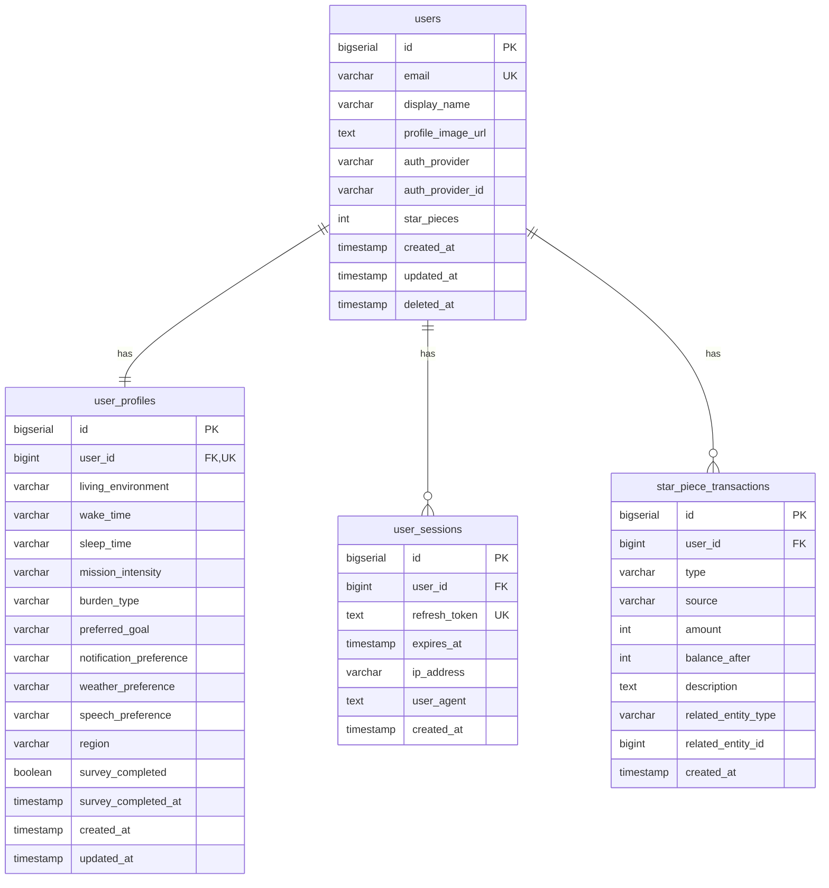
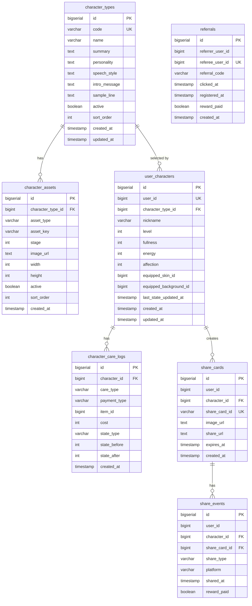
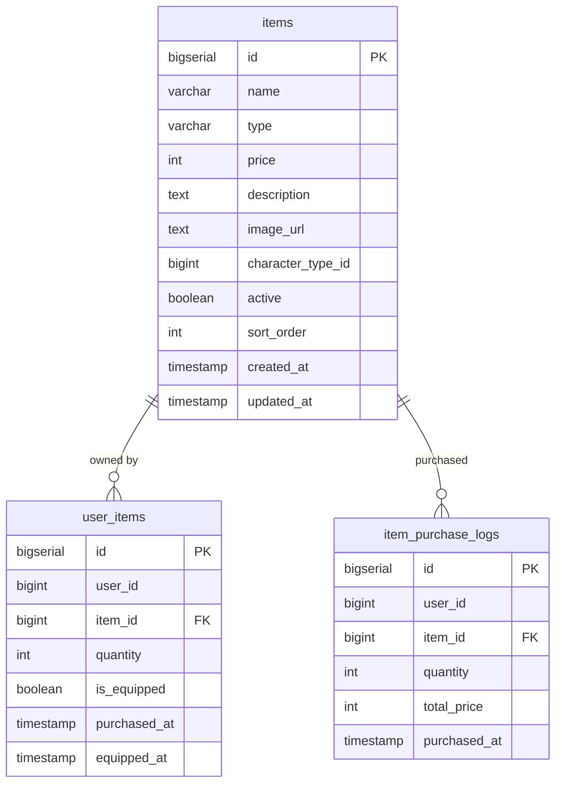
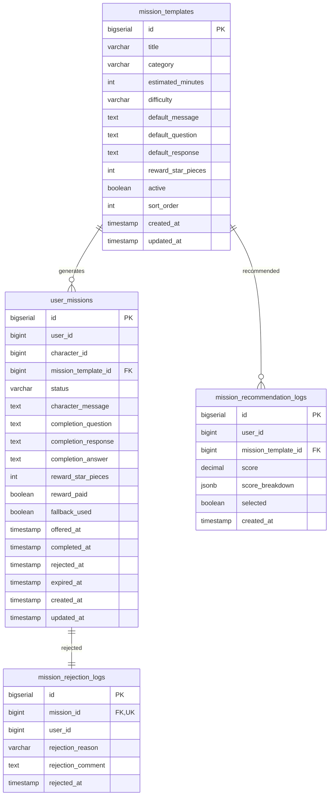
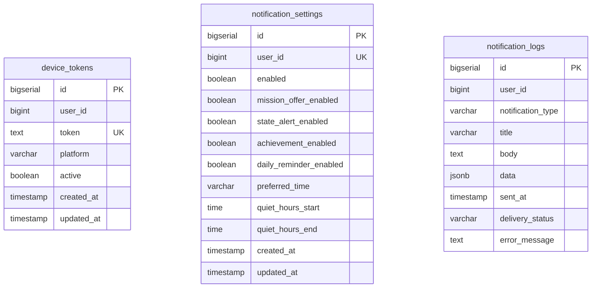
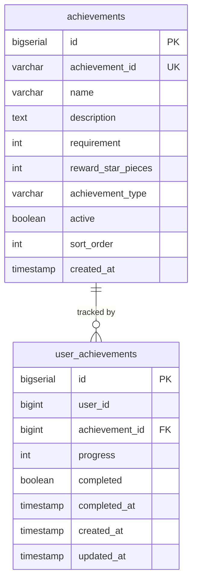
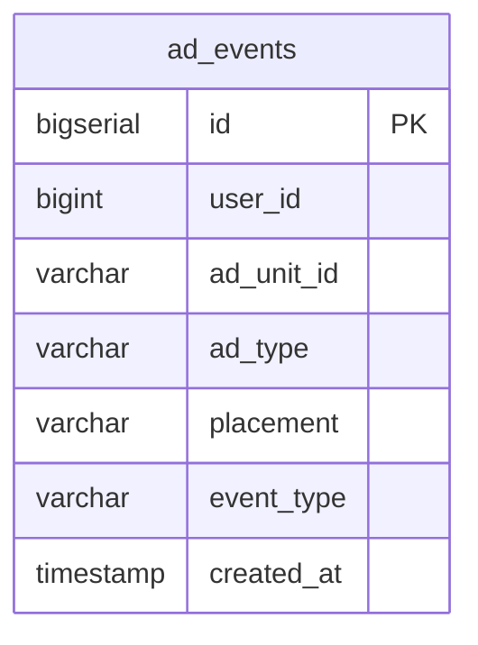
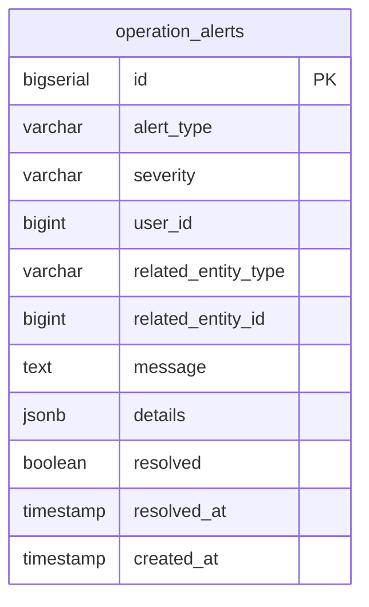

# 05. ERD (Entity Relationship Diagram)

## 문서 정보

| 항목 | 내용 |
|------|------|
| 문서명 | Polaris MVP ERD |
| 작성일 | 2026-05-14 |
| 버전 | v1.0 |
| 목적 | 데이터베이스 스키마 및 엔티티 관계 정의 |
| 대상 독자 | 백엔드 개발자, DBA |

---

## 📋 목차

1. [ERD 개요](#erd-개요)
2. [모듈별 ERD](#모듈별-erd)
3. [전체 ERD](#전체-erd)
4. [테이블 상세 명세](#테이블-상세-명세)

---

## ERD 개요

### 설계 원칙

#### 1. 모듈러 모놀리스 구조
- 각 모듈은 독립적인 데이터베이스 스키마 소유
- 향후 MSA 전환을 대비한 설계

#### 2. FK 정책
- **같은 모듈 내**: FK 제약조건 사용 ✅
- **다른 모듈 간**: FK 없이 ID만 저장 ❌
- 모든 외래 키에 인덱스 생성

#### 3. 소프트 삭제
- 중요 데이터는 `deleted_at` 컬럼으로 소프트 삭제
- 물리 삭제는 운영 정책에 따라 별도 처리

#### 4. 타임스탬프
- 모든 테이블에 `created_at`, `updated_at` 포함
- 이력 추적이 필요한 테이블은 추가 타임스탬프 컬럼

---

## 모듈 구조

```
📦 Polaris Backend (10개 모듈, 25개 테이블)

├── 🔐 Gateway Module (0개 테이블)
├── 👤 User Module (4개 테이블)
├── 🐾 Character Module (7개 테이블)
├── 🎁 Item Module (3개 테이블)
├── 🎯 Mission Module (4개 테이블)
├── 🤖 AI Module (0개 테이블)
├── 📢 Notification Module (3개 테이블)
├── 🏆 Achievement Module (2개 테이블) - MVP 이후
├── 📊 Analytics Module (1개 테이블) - MVP 이후
└── 🔧 Operation Module (1개 테이블)
```

---

## 모듈별 ERD

### 👤 User Module



**범례:**
- `PK`: Primary Key
- `FK`: Foreign Key
- `UK`: Unique Key
- `⏰`: MVP 이후 구현

---

### 🐾 Character Module



---

### 🎁 Item Module



---

### 🎯 Mission Module



---

### 📢 Notification Module



---

### 🏆 Achievement Module (⏰ MVP 이후)



---

### 📊 Analytics Module (⏰ MVP 이후)



---

### 🔧 Operation Module



---


## 전체 ERD (모듈 간 관계 포함)

```mermaid
erDiagram
    %% User Module
    users ||--|| user_profiles : "has"
    users ||--o{ user_sessions : "has"
    users ||--o{ star_piece_transactions : "has"
    
    %% Character Module
    character_types ||--o{ character_assets : "has"
    character_types ||--o{ user_characters : "selected by"
    user_characters ||--o{ character_care_logs : "has"
    user_characters ||--o{ share_cards : "creates"
    share_cards ||--o{ share_events : "has"
    
    %% Item Module
    items ||--o{ user_items : "owned by"
    items ||--o{ item_purchase_logs : "purchased"
    
    %% Mission Module
    mission_templates ||--o{ user_missions : "generates"
    mission_templates ||--o{ mission_recommendation_logs : "recommended"
    user_missions ||--|| mission_rejection_logs : "rejected"
    
    %% Achievement Module (MVP 이후)
    achievements ||--o{ user_achievements : "tracked by"
    
    %% 모듈 간 관계 (ID만 저장, FK 없음)
    users ||--|| user_characters : "owns (no FK)"
    users ||--o{ user_items : "owns (no FK)"
    users ||--o{ user_missions : "has (no FK)"
    users ||--o{ device_tokens : "has (no FK)"
    users ||--|| notification_settings : "has (no FK)"
    users ||--o{ notification_logs : "receives (no FK)"
    users ||--o{ user_achievements : "achieves (no FK)"
    users ||--o{ ad_events : "triggers (no FK)"
    users ||--o{ item_purchase_logs : "purchases (no FK)"
    users ||--o{ share_cards : "creates (no FK)"
    users ||--o{ share_events : "shares (no FK)"
    users ||--o{ referrals : "refers (no FK)"
    users ||--o{ mission_rejection_logs : "rejects (no FK)"
    users ||--o{ mission_recommendation_logs : "recommended (no FK)"
    users ||--o{ operation_alerts : "related (no FK)"
    
    user_characters ||--o{ user_missions : "receives (no FK)"
    user_characters ||--o{ share_events : "shares (no FK)"
    
    character_types ||--o{ items : "exclusive (no FK)"
    
    items ||--o{ user_characters : "equipped (no FK)"
    items ||--o{ character_care_logs : "used (no FK)"
    
    users {
        bigserial id PK
        varchar email UK
        varchar display_name
        text profile_image_url
        varchar auth_provider
        varchar auth_provider_id
        int star_pieces
        timestamp created_at
        timestamp updated_at
        timestamp deleted_at
    }
    
    user_profiles {
        bigserial id PK
        bigint user_id FK,UK
        varchar living_environment
        varchar wake_time
        varchar sleep_time
        varchar mission_intensity
        varchar burden_type
        varchar preferred_goal
        varchar notification_preference
        varchar weather_preference
        varchar speech_preference
        varchar region
        boolean survey_completed
        timestamp survey_completed_at
        timestamp created_at
        timestamp updated_at
    }
    
    user_sessions {
        bigserial id PK
        bigint user_id FK
        text refresh_token UK
        timestamp expires_at
        varchar ip_address
        text user_agent
        timestamp created_at
    }
    
    star_piece_transactions {
        bigserial id PK
        bigint user_id FK
        varchar type
        varchar source
        int amount
        int balance_after
        text description
        varchar related_entity_type
        bigint related_entity_id
        timestamp created_at
    }
    
    character_types {
        bigserial id PK
        varchar code UK
        varchar name
        text summary
        text personality
        text speech_style
        text intro_message
        text sample_line
        boolean active
        int sort_order
        timestamp created_at
        timestamp updated_at
    }
    
    character_assets {
        bigserial id PK
        bigint character_type_id FK
        varchar asset_type
        varchar asset_key
        int stage
        text image_url
        int width
        int height
        boolean active
        int sort_order
        timestamp created_at
    }
    
    user_characters {
        bigserial id PK
        bigint user_id UK
        bigint character_type_id FK
        varchar nickname
        int level
        int fullness
        int energy
        int affection
        bigint equipped_skin_id
        bigint equipped_background_id
        timestamp last_state_updated_at
        timestamp created_at
        timestamp updated_at
    }
    
    character_care_logs {
        bigserial id PK
        bigint character_id FK
        varchar care_type
        varchar payment_type
        bigint item_id
        int cost
        varchar state_type
        int state_before
        int state_after
        timestamp created_at
    }
    
    share_cards {
        bigserial id PK
        bigint user_id
        bigint character_id FK
        varchar share_card_id UK
        text image_url
        text share_url
        timestamp expires_at
        timestamp created_at
    }
    
    share_events {
        bigserial id PK
        bigint user_id
        bigint character_id FK
        bigint share_card_id FK
        varchar share_type
        varchar platform
        timestamp shared_at
        boolean reward_paid
    }
    
    referrals {
        bigserial id PK
        bigint referrer_user_id
        bigint referee_user_id UK
        varchar referral_code
        timestamp clicked_at
        timestamp registered_at
        boolean reward_paid
        timestamp created_at
    }
    
    items {
        bigserial id PK
        varchar name
        varchar type
        int price
        text description
        text image_url
        bigint character_type_id
        boolean active
        int sort_order
        timestamp created_at
        timestamp updated_at
    }
    
    user_items {
        bigserial id PK
        bigint user_id
        bigint item_id FK
        int quantity
        boolean is_equipped
        timestamp purchased_at
        timestamp equipped_at
    }
    
    item_purchase_logs {
        bigserial id PK
        bigint user_id
        bigint item_id FK
        int quantity
        int total_price
        timestamp purchased_at
    }
    
    mission_templates {
        bigserial id PK
        varchar title
        varchar category
        int estimated_minutes
        varchar difficulty
        text default_message
        text default_question
        text default_response
        int reward_star_pieces
        boolean active
        int sort_order
        timestamp created_at
        timestamp updated_at
    }
    
    user_missions {
        bigserial id PK
        bigint user_id
        bigint character_id
        bigint mission_template_id FK
        varchar status
        text character_message
        text completion_question
        text completion_response
        text completion_answer
        int reward_star_pieces
        boolean reward_paid
        boolean fallback_used
        timestamp offered_at
        timestamp completed_at
        timestamp rejected_at
        timestamp expired_at
        timestamp created_at
        timestamp updated_at
    }
    
    mission_rejection_logs {
        bigserial id PK
        bigint mission_id FK,UK
        bigint user_id
        varchar rejection_reason
        text rejection_comment
        timestamp rejected_at
    }
    
    mission_recommendation_logs {
        bigserial id PK
        bigint user_id
        bigint mission_template_id FK
        decimal score
        jsonb score_breakdown
        boolean selected
        timestamp created_at
    }
    
    device_tokens {
        bigserial id PK
        bigint user_id
        text token UK
        varchar platform
        boolean active
        timestamp created_at
        timestamp updated_at
    }
    
    notification_settings {
        bigserial id PK
        bigint user_id UK
        boolean enabled
        boolean mission_offer_enabled
        boolean state_alert_enabled
        boolean achievement_enabled
        boolean daily_reminder_enabled
        varchar preferred_time
        time quiet_hours_start
        time quiet_hours_end
        timestamp created_at
        timestamp updated_at
    }
    
    notification_logs {
        bigserial id PK
        bigint user_id
        varchar notification_type
        varchar title
        text body
        jsonb data
        timestamp sent_at
        varchar delivery_status
        text error_message
    }
    
    achievements {
        bigserial id PK
        varchar achievement_id UK
        varchar name
        text description
        int requirement
        int reward_star_pieces
        varchar achievement_type
        boolean active
        int sort_order
        timestamp created_at
    }
    
    user_achievements {
        bigserial id PK
        bigint user_id
        bigint achievement_id FK
        int progress
        boolean completed
        timestamp completed_at
        timestamp created_at
        timestamp updated_at
    }
    
    ad_events {
        bigserial id PK
        bigint user_id
        varchar ad_unit_id
        varchar ad_type
        varchar placement
        varchar event_type
        timestamp created_at
    }
    
    operation_alerts {
        bigserial id PK
        varchar alert_type
        varchar severity
        bigint user_id
        varchar related_entity_type
        bigint related_entity_id
        text message
        jsonb details
        boolean resolved
        timestamp resolved_at
        timestamp created_at
    }
```



---

## 테이블 상세 명세

### 📊 테이블 통계

| 모듈 | 테이블 수 | MVP 포함 | MVP 이후 |
|------|-----------|----------|----------|
| Gateway | 0 | 0 | 0 |
| User | 4 | 3 | 1 |
| Character | 7 | 7 | 0 |
| Item | 3 | 3 | 0 |
| Mission | 4 | 4 | 0 |
| AI | 0 | 0 | 0 |
| Notification | 3 | 3 | 0 |
| Achievement | 2 | 0 | 2 |
| Analytics | 1 | 0 | 1 |
| Operation | 1 | 1 | 0 |
| **총계** | **25** | **21** | **4** |

---

### 👤 User Module 테이블

#### users
사용자 기본 정보

| 컬럼 | 타입 | 제약 | 설명 |
|------|------|------|------|
| id | BIGSERIAL | PK | 사용자 ID |
| email | VARCHAR(255) | NOT NULL, UNIQUE | 이메일 |
| display_name | VARCHAR(100) | NOT NULL | 표시 이름 |
| profile_image_url | TEXT | | 프로필 이미지 URL |
| auth_provider | VARCHAR(50) | NOT NULL | 인증 제공자 (GOOGLE, APPLE) |
| auth_provider_id | VARCHAR(255) | NOT NULL | 제공자별 사용자 ID |
| star_pieces | INT | NOT NULL, DEFAULT 0 | 보유 별조각 |
| created_at | TIMESTAMP | NOT NULL, DEFAULT NOW() | 생성일시 |
| updated_at | TIMESTAMP | NOT NULL, DEFAULT NOW() | 수정일시 |
| deleted_at | TIMESTAMP | | 삭제일시 (소프트 삭제) |

**인덱스:**
- `idx_users_email` ON (email)
- `idx_users_deleted_at` ON (deleted_at)
- `uk_auth_provider` UNIQUE (auth_provider, auth_provider_id)

---

#### user_profiles
사용자 프로필 및 온보딩 설문 답변

| 컬럼 | 타입 | 제약 | 설명 |
|------|------|------|------|
| id | BIGSERIAL | PK | 프로필 ID |
| user_id | BIGINT | FK, NOT NULL, UNIQUE | 사용자 ID |
| living_environment | VARCHAR(50) | | 생활 환경 |
| wake_time | VARCHAR(50) | | 기상 시간 |
| sleep_time | VARCHAR(50) | | 취침 시간 |
| mission_intensity | VARCHAR(50) | | 미션 강도 선호 |
| burden_type | VARCHAR(50) | | 부담스러운 미션 유형 |
| preferred_goal | VARCHAR(50) | | 선호 목표 |
| notification_preference | VARCHAR(50) | | 알림 선호 시간대 |
| weather_preference | VARCHAR(50) | | 날씨 활용 선호 |
| speech_preference | VARCHAR(50) | | 말투 선호 |
| region | VARCHAR(100) | | 지역 (날씨 API용) |
| survey_completed | BOOLEAN | NOT NULL, DEFAULT FALSE | 설문 완료 여부 |
| survey_completed_at | TIMESTAMP | | 설문 완료일시 |
| created_at | TIMESTAMP | NOT NULL, DEFAULT NOW() | 생성일시 |
| updated_at | TIMESTAMP | NOT NULL, DEFAULT NOW() | 수정일시 |

**인덱스:**
- `idx_user_profiles_user_id` ON (user_id)

**FK:**
- `fk_user_profiles_user_id` REFERENCES users(id) ON DELETE CASCADE

---

#### user_sessions (⏰ MVP 이후)
로그인 세션 관리

| 컬럼 | 타입 | 제약 | 설명 |
|------|------|------|------|
| id | BIGSERIAL | PK | 세션 ID |
| user_id | BIGINT | FK, NOT NULL | 사용자 ID |
| refresh_token | TEXT | NOT NULL, UNIQUE | Refresh Token |
| expires_at | TIMESTAMP | NOT NULL | 만료일시 |
| ip_address | VARCHAR(45) | | IP 주소 |
| user_agent | TEXT | | User Agent |
| created_at | TIMESTAMP | NOT NULL, DEFAULT NOW() | 생성일시 |

**인덱스:**
- `idx_user_sessions_user_id` ON (user_id)
- `idx_user_sessions_expires_at` ON (expires_at)

**FK:**
- `fk_user_sessions_user_id` REFERENCES users(id) ON DELETE CASCADE

---

#### star_piece_transactions
별조각 거래 내역

| 컬럼 | 타입 | 제약 | 설명 |
|------|------|------|------|
| id | BIGSERIAL | PK | 거래 ID |
| user_id | BIGINT | FK, NOT NULL | 사용자 ID |
| type | VARCHAR(20) | NOT NULL | 거래 유형 (EARN, SPEND) |
| source | VARCHAR(50) | NOT NULL | 거래 출처 |
| amount | INT | NOT NULL | 거래 금액 (양수/음수) |
| balance_after | INT | NOT NULL | 거래 후 잔액 |
| description | TEXT | | 거래 설명 |
| related_entity_type | VARCHAR(50) | | 관련 엔티티 타입 |
| related_entity_id | BIGINT | | 관련 엔티티 ID |
| created_at | TIMESTAMP | NOT NULL, DEFAULT NOW() | 생성일시 |

**인덱스:**
- `idx_star_piece_transactions_user_id` ON (user_id)
- `idx_star_piece_transactions_created_at` ON (created_at)
- `idx_star_piece_transactions_source` ON (source)

**FK:**
- `fk_star_piece_transactions_user_id` REFERENCES users(id) ON DELETE CASCADE

---

### 🐾 Character Module 테이블

#### character_types
캐릭터 종류 (노바, 무무, 쪼리)

| 컬럼 | 타입 | 제약 | 설명 |
|------|------|------|------|
| id | BIGSERIAL | PK | 캐릭터 타입 ID |
| code | VARCHAR(50) | NOT NULL, UNIQUE | 캐릭터 코드 (NOVA, MUMU, JJORY) |
| name | VARCHAR(100) | NOT NULL | 캐릭터 이름 |
| summary | TEXT | | 한 줄 소개 |
| personality | TEXT | | 성격 설명 |
| speech_style | TEXT | | 말투 설명 |
| intro_message | TEXT | | 소개 메시지 |
| sample_line | TEXT | | 대표 대사 |
| active | BOOLEAN | NOT NULL, DEFAULT TRUE | 활성 여부 |
| sort_order | INT | NOT NULL, DEFAULT 0 | 정렬 순서 |
| created_at | TIMESTAMP | NOT NULL, DEFAULT NOW() | 생성일시 |
| updated_at | TIMESTAMP | NOT NULL, DEFAULT NOW() | 수정일시 |

**인덱스:**
- `idx_character_types_code` ON (code)
- `idx_character_types_active` ON (active)

---

#### character_assets
캐릭터 이미지 리소스

| 컬럼 | 타입 | 제약 | 설명 |
|------|------|------|------|
| id | BIGSERIAL | PK | 에셋 ID |
| character_type_id | BIGINT | FK, NOT NULL | 캐릭터 타입 ID |
| asset_type | VARCHAR(50) | NOT NULL | 에셋 타입 |
| asset_key | VARCHAR(100) | NOT NULL | 에셋 키 |
| stage | INT | | 레벨/성장 단계 (향후) |
| image_url | TEXT | NOT NULL | 이미지 URL |
| width | INT | | 이미지 너비 |
| height | INT | | 이미지 높이 |
| active | BOOLEAN | NOT NULL, DEFAULT TRUE | 활성 여부 |
| sort_order | INT | NOT NULL, DEFAULT 0 | 정렬 순서 |
| created_at | TIMESTAMP | NOT NULL, DEFAULT NOW() | 생성일시 |

**인덱스:**
- `idx_character_assets_character_type_id` ON (character_type_id)
- `idx_character_assets_asset_type` ON (asset_type)
- `uk_character_assets` UNIQUE (character_type_id, asset_key, stage)

**FK:**
- `fk_character_assets_character_type_id` REFERENCES character_types(id) ON DELETE CASCADE

---

#### user_characters
사용자가 보유한 캐릭터

| 컬럼 | 타입 | 제약 | 설명 |
|------|------|------|------|
| id | BIGSERIAL | PK | 사용자 캐릭터 ID |
| user_id | BIGINT | NOT NULL, UNIQUE | 사용자 ID (FK 없음) |
| character_type_id | BIGINT | FK, NOT NULL | 캐릭터 타입 ID |
| nickname | VARCHAR(100) | NOT NULL | 캐릭터 닉네임 |
| level | INT | NOT NULL, DEFAULT 1 | 레벨 |
| fullness | INT | NOT NULL, DEFAULT 100 | 포만감 (0~100) |
| energy | INT | NOT NULL, DEFAULT 100 | 기운 (0~100) |
| affection | INT | NOT NULL, DEFAULT 50 | 애정 (0~100) |
| equipped_skin_id | BIGINT | | 장착 스킨 ID (FK 없음) |
| equipped_background_id | BIGINT | | 장착 배경 ID (FK 없음) |
| last_state_updated_at | TIMESTAMP | NOT NULL, DEFAULT NOW() | 마지막 상태 갱신일시 |
| created_at | TIMESTAMP | NOT NULL, DEFAULT NOW() | 생성일시 |
| updated_at | TIMESTAMP | NOT NULL, DEFAULT NOW() | 수정일시 |

**인덱스:**
- `idx_user_characters_user_id` ON (user_id)
- `idx_user_characters_character_type_id` ON (character_type_id)
- `idx_user_characters_last_state_updated_at` ON (last_state_updated_at)

**FK:**
- `fk_user_characters_character_type_id` REFERENCES character_types(id)

---

#### character_care_logs
돌봄 액션 이력

| 컬럼 | 타입 | 제약 | 설명 |
|------|------|------|------|
| id | BIGSERIAL | PK | 돌봄 로그 ID |
| character_id | BIGINT | FK, NOT NULL | 캐릭터 ID |
| care_type | VARCHAR(50) | NOT NULL | 돌봄 유형 (FEED, SLEEP, PLAY) |
| payment_type | VARCHAR(50) | NOT NULL | 결제 유형 (STAR_PIECE, ITEM, FREE) |
| item_id | BIGINT | | 사용한 아이템 ID (FK 없음) |
| cost | INT | NOT NULL, DEFAULT 0 | 비용 |
| state_type | VARCHAR(50) | NOT NULL | 상태 유형 (fullness, energy, affection) |
| state_before | INT | NOT NULL | 변경 전 상태 |
| state_after | INT | NOT NULL | 변경 후 상태 |
| created_at | TIMESTAMP | NOT NULL, DEFAULT NOW() | 생성일시 |

**인덱스:**
- `idx_character_care_logs_character_id` ON (character_id)
- `idx_character_care_logs_created_at` ON (created_at)
- `idx_character_care_logs_care_type` ON (care_type)

**FK:**
- `fk_character_care_logs_character_id` REFERENCES user_characters(id) ON DELETE CASCADE

---

#### share_cards
생성된 공유 카드

| 컬럼 | 타입 | 제약 | 설명 |
|------|------|------|------|
| id | BIGSERIAL | PK | 공유 카드 ID |
| user_id | BIGINT | NOT NULL | 사용자 ID (FK 없음) |
| character_id | BIGINT | FK, NOT NULL | 캐릭터 ID |
| share_card_id | VARCHAR(100) | NOT NULL, UNIQUE | 공유 카드 UUID |
| image_url | TEXT | NOT NULL | 카드 이미지 URL |
| share_url | TEXT | NOT NULL | 공유 URL |
| expires_at | TIMESTAMP | NOT NULL | 만료일시 |
| created_at | TIMESTAMP | NOT NULL, DEFAULT NOW() | 생성일시 |

**인덱스:**
- `idx_share_cards_user_id` ON (user_id)
- `idx_share_cards_character_id` ON (character_id)
- `idx_share_cards_share_card_id` ON (share_card_id)
- `idx_share_cards_expires_at` ON (expires_at)

**FK:**
- `fk_share_cards_character_id` REFERENCES user_characters(id) ON DELETE CASCADE

---

#### share_events
공유 이벤트 기록

| 컬럼 | 타입 | 제약 | 설명 |
|------|------|------|------|
| id | BIGSERIAL | PK | 공유 이벤트 ID |
| user_id | BIGINT | NOT NULL | 사용자 ID (FK 없음) |
| character_id | BIGINT | FK, NOT NULL | 캐릭터 ID |
| share_card_id | BIGINT | FK, NOT NULL | 공유 카드 ID |
| share_type | VARCHAR(50) | NOT NULL | 공유 유형 (CHARACTER_CARD) |
| platform | VARCHAR(50) | | 공유 플랫폼 (KAKAO, INSTAGRAM, TWITTER) |
| shared_at | TIMESTAMP | NOT NULL, DEFAULT NOW() | 공유일시 |
| reward_paid | BOOLEAN | NOT NULL, DEFAULT FALSE | 보상 지급 여부 |

**인덱스:**
- `idx_share_events_user_id` ON (user_id)
- `idx_share_events_character_id` ON (character_id)
- `idx_share_events_shared_at` ON (shared_at)
- `idx_share_events_reward_paid` ON (reward_paid)

**FK:**
- `fk_share_events_character_id` REFERENCES user_characters(id) ON DELETE CASCADE
- `fk_share_events_share_card_id` REFERENCES share_cards(id) ON DELETE CASCADE

---

#### referrals
추천인 추적

| 컬럼 | 타입 | 제약 | 설명 |
|------|------|------|------|
| id | BIGSERIAL | PK | 추천 ID |
| referrer_user_id | BIGINT | NOT NULL | 추천한 사용자 ID (FK 없음) |
| referee_user_id | BIGINT | NOT NULL, UNIQUE | 추천받은 사용자 ID (FK 없음) |
| referral_code | VARCHAR(100) | NOT NULL | 추천 코드 |
| clicked_at | TIMESTAMP | | 링크 클릭일시 |
| registered_at | TIMESTAMP | | 가입일시 |
| reward_paid | BOOLEAN | NOT NULL, DEFAULT FALSE | 보상 지급 여부 |
| created_at | TIMESTAMP | NOT NULL, DEFAULT NOW() | 생성일시 |

**인덱스:**
- `idx_referrals_referrer_user_id` ON (referrer_user_id)
- `idx_referrals_referee_user_id` ON (referee_user_id)
- `idx_referrals_referral_code` ON (referral_code)

---


### 🎁 Item Module 테이블

#### items
구매 가능한 아이템

| 컬럼 | 타입 | 제약 | 설명 |
|------|------|------|------|
| id | BIGSERIAL | PK | 아이템 ID |
| name | VARCHAR(200) | NOT NULL | 아이템 이름 |
| type | VARCHAR(50) | NOT NULL | 아이템 유형 |
| price | INT | NOT NULL | 가격 (별조각) |
| description | TEXT | | 설명 |
| image_url | TEXT | | 이미지 URL |
| character_type_id | BIGINT | | 캐릭터 전용 아이템 (FK 없음) |
| active | BOOLEAN | NOT NULL, DEFAULT TRUE | 활성 여부 |
| sort_order | INT | NOT NULL, DEFAULT 0 | 정렬 순서 |
| created_at | TIMESTAMP | NOT NULL, DEFAULT NOW() | 생성일시 |
| updated_at | TIMESTAMP | NOT NULL, DEFAULT NOW() | 수정일시 |

**아이템 유형:**
- SKIN: 캐릭터 스킨
- BACKGROUND: 배경
- CONSUMABLE_FOOD: 밥 주기 아이템
- CONSUMABLE_TOY: 놀아주기 아이템
- CONSUMABLE_REST: 재우기 아이템

**인덱스:**
- `idx_items_type` ON (type)
- `idx_items_character_type_id` ON (character_type_id)
- `idx_items_active` ON (active)

---

#### user_items
사용자 보유 아이템

| 컬럼 | 타입 | 제약 | 설명 |
|------|------|------|------|
| id | BIGSERIAL | PK | 보유 아이템 ID |
| user_id | BIGINT | NOT NULL | 사용자 ID (FK 없음) |
| item_id | BIGINT | FK, NOT NULL | 아이템 ID |
| quantity | INT | NOT NULL, DEFAULT 1 | 수량 (소모품용) |
| is_equipped | BOOLEAN | NOT NULL, DEFAULT FALSE | 장착 여부 (스킨/배경용) |
| purchased_at | TIMESTAMP | NOT NULL, DEFAULT NOW() | 구매일시 |
| equipped_at | TIMESTAMP | | 장착일시 |

**인덱스:**
- `idx_user_items_user_id` ON (user_id)
- `idx_user_items_item_id` ON (item_id)
- `idx_user_items_is_equipped` ON (is_equipped)
- `uk_user_items` UNIQUE (user_id, item_id)

**FK:**
- `fk_user_items_item_id` REFERENCES items(id)

---

#### item_purchase_logs
아이템 구매 이력

| 컬럼 | 타입 | 제약 | 설명 |
|------|------|------|------|
| id | BIGSERIAL | PK | 구매 로그 ID |
| user_id | BIGINT | NOT NULL | 사용자 ID (FK 없음) |
| item_id | BIGINT | FK, NOT NULL | 아이템 ID |
| quantity | INT | NOT NULL, DEFAULT 1 | 구매 수량 |
| total_price | INT | NOT NULL | 총 가격 |
| purchased_at | TIMESTAMP | NOT NULL, DEFAULT NOW() | 구매일시 |

**인덱스:**
- `idx_item_purchase_logs_user_id` ON (user_id)
- `idx_item_purchase_logs_item_id` ON (item_id)
- `idx_item_purchase_logs_purchased_at` ON (purchased_at)

**FK:**
- `fk_item_purchase_logs_item_id` REFERENCES items(id)

---

### 🎯 Mission Module 테이블

#### mission_templates
미션 시드 템플릿

| 컬럼 | 타입 | 제약 | 설명 |
|------|------|------|------|
| id | BIGSERIAL | PK | 미션 템플릿 ID |
| title | VARCHAR(200) | NOT NULL | 미션 제목 |
| category | VARCHAR(50) | NOT NULL | 미션 카테고리 |
| estimated_minutes | INT | NOT NULL | 예상 소요 시간 (분) |
| difficulty | VARCHAR(50) | NOT NULL | 난이도 |
| default_message | TEXT | NOT NULL | 기본 제안 메시지 (Fallback) |
| default_question | TEXT | NOT NULL | 기본 완료 질문 (Fallback) |
| default_response | TEXT | NOT NULL | 기본 완료 반응 (Fallback) |
| reward_star_pieces | INT | NOT NULL, DEFAULT 10 | 보상 별조각 |
| active | BOOLEAN | NOT NULL, DEFAULT TRUE | 활성 여부 |
| sort_order | INT | NOT NULL, DEFAULT 0 | 정렬 순서 |
| created_at | TIMESTAMP | NOT NULL, DEFAULT NOW() | 생성일시 |
| updated_at | TIMESTAMP | NOT NULL, DEFAULT NOW() | 수정일시 |

**미션 카테고리:**
- BASIC_ROUTINE: 기본 루틴
- SPACE_RESET: 공간 정리
- BODY_CARE: 몸 돌보기
- OUTDOOR_LIGHT: 가벼운 외출
- MIND_RECORD: 기록/감정
- REST_RECOVERY: 휴식/회복
- SOCIAL_LIGHT: 약한 연결

**난이도:**
- VERY_LIGHT: 매우 가벼움
- LIGHT: 가벼움
- NORMAL: 보통
- CHALLENGE: 도전적

**인덱스:**
- `idx_mission_templates_category` ON (category)
- `idx_mission_templates_difficulty` ON (difficulty)
- `idx_mission_templates_active` ON (active)

---

#### user_missions
사용자별 생성된 미션

| 컬럼 | 타입 | 제약 | 설명 |
|------|------|------|------|
| id | BIGSERIAL | PK | 사용자 미션 ID |
| user_id | BIGINT | NOT NULL | 사용자 ID (FK 없음) |
| character_id | BIGINT | NOT NULL | 캐릭터 ID (FK 없음) |
| mission_template_id | BIGINT | FK, NOT NULL | 미션 템플릿 ID |
| status | VARCHAR(50) | NOT NULL | 미션 상태 |
| character_message | TEXT | NOT NULL | 캐릭터 제안 메시지 |
| completion_question | TEXT | NOT NULL | 완료 질문 |
| completion_response | TEXT | | 완료 반응 |
| completion_answer | TEXT | | 사용자 답변 |
| reward_star_pieces | INT | NOT NULL | 보상 별조각 |
| reward_paid | BOOLEAN | NOT NULL, DEFAULT FALSE | 보상 지급 여부 |
| fallback_used | BOOLEAN | NOT NULL, DEFAULT FALSE | Fallback 사용 여부 |
| offered_at | TIMESTAMP | | 제안일시 |
| completed_at | TIMESTAMP | | 완료일시 |
| rejected_at | TIMESTAMP | | 거절일시 |
| expired_at | TIMESTAMP | | 만료일시 |
| created_at | TIMESTAMP | NOT NULL, DEFAULT NOW() | 생성일시 |
| updated_at | TIMESTAMP | NOT NULL, DEFAULT NOW() | 수정일시 |

**미션 상태:**
- GENERATED: 생성됨 (아직 노출 안 됨)
- OFFERED: 제안됨
- REJECTED: 거절됨
- ANSWERING: 답변 중
- COMPLETED: 완료됨
- EXPIRED: 만료됨

**인덱스:**
- `idx_user_missions_user_id` ON (user_id)
- `idx_user_missions_character_id` ON (character_id)
- `idx_user_missions_mission_template_id` ON (mission_template_id)
- `idx_user_missions_status` ON (status)
- `idx_user_missions_offered_at` ON (offered_at)
- `idx_user_missions_completed_at` ON (completed_at)

**FK:**
- `fk_user_missions_mission_template_id` REFERENCES mission_templates(id)

---

#### mission_rejection_logs
미션 거절 이력

| 컬럼 | 타입 | 제약 | 설명 |
|------|------|------|------|
| id | BIGSERIAL | PK | 거절 로그 ID |
| mission_id | BIGINT | FK, NOT NULL, UNIQUE | 미션 ID |
| user_id | BIGINT | NOT NULL | 사용자 ID (FK 없음) |
| rejection_reason | VARCHAR(50) | NOT NULL | 거절 사유 |
| rejection_comment | TEXT | | 거절 코멘트 |
| rejected_at | TIMESTAMP | NOT NULL, DEFAULT NOW() | 거절일시 |

**거절 사유:**
- TOO_LAZY: 너무 귀찮아요
- OUTDOOR_BURDEN: 지금은 밖에 나가기 싫어요
- TOO_HARD: 너무 어려워요
- ALREADY_DONE: 이미 했어요
- NOT_INTERESTED: 마음에 안 들어요
- OTHER: 다른 이유

**인덱스:**
- `idx_mission_rejection_logs_user_id` ON (user_id)
- `idx_mission_rejection_logs_rejection_reason` ON (rejection_reason)
- `idx_mission_rejection_logs_rejected_at` ON (rejected_at)

**FK:**
- `fk_mission_rejection_logs_mission_id` REFERENCES user_missions(id) ON DELETE CASCADE

---

#### mission_recommendation_logs
미션 추천 알고리즘 로그

| 컬럼 | 타입 | 제약 | 설명 |
|------|------|------|------|
| id | BIGSERIAL | PK | 추천 로그 ID |
| user_id | BIGINT | NOT NULL | 사용자 ID (FK 없음) |
| mission_template_id | BIGINT | FK, NOT NULL | 미션 템플릿 ID |
| score | DECIMAL(10, 2) | NOT NULL | 추천 점수 |
| score_breakdown | JSONB | | 점수 계산 상세 (디버깅용) |
| selected | BOOLEAN | NOT NULL, DEFAULT FALSE | 선택 여부 |
| created_at | TIMESTAMP | NOT NULL, DEFAULT NOW() | 생성일시 |

**인덱스:**
- `idx_mission_recommendation_logs_user_id` ON (user_id)
- `idx_mission_recommendation_logs_mission_template_id` ON (mission_template_id)
- `idx_mission_recommendation_logs_created_at` ON (created_at)
- `idx_mission_recommendation_logs_selected` ON (selected)

**FK:**
- `fk_mission_recommendation_logs_mission_template_id` REFERENCES mission_templates(id)

---

### 📢 Notification Module 테이블

#### device_tokens
푸시 알림용 디바이스 토큰

| 컬럼 | 타입 | 제약 | 설명 |
|------|------|------|------|
| id | BIGSERIAL | PK | 디바이스 토큰 ID |
| user_id | BIGINT | NOT NULL | 사용자 ID (FK 없음) |
| token | TEXT | NOT NULL, UNIQUE | FCM/APNs 토큰 |
| platform | VARCHAR(20) | NOT NULL | 플랫폼 (IOS, ANDROID) |
| active | BOOLEAN | NOT NULL, DEFAULT TRUE | 활성 여부 |
| created_at | TIMESTAMP | NOT NULL, DEFAULT NOW() | 생성일시 |
| updated_at | TIMESTAMP | NOT NULL, DEFAULT NOW() | 수정일시 |

**인덱스:**
- `idx_device_tokens_user_id` ON (user_id)
- `idx_device_tokens_active` ON (active)

---

#### notification_settings
사용자 알림 설정

| 컬럼 | 타입 | 제약 | 설명 |
|------|------|------|------|
| id | BIGSERIAL | PK | 알림 설정 ID |
| user_id | BIGINT | NOT NULL, UNIQUE | 사용자 ID (FK 없음) |
| enabled | BOOLEAN | NOT NULL, DEFAULT TRUE | 알림 활성화 |
| mission_offer_enabled | BOOLEAN | NOT NULL, DEFAULT TRUE | 미션 제안 알림 |
| state_alert_enabled | BOOLEAN | NOT NULL, DEFAULT TRUE | 상태 알림 |
| achievement_enabled | BOOLEAN | NOT NULL, DEFAULT TRUE | 업적 알림 |
| daily_reminder_enabled | BOOLEAN | NOT NULL, DEFAULT TRUE | 일일 리마인더 |
| preferred_time | VARCHAR(50) | | 선호 시간대 |
| quiet_hours_start | TIME | | 방해 금지 시작 시간 |
| quiet_hours_end | TIME | | 방해 금지 종료 시간 |
| created_at | TIMESTAMP | NOT NULL, DEFAULT NOW() | 생성일시 |
| updated_at | TIMESTAMP | NOT NULL, DEFAULT NOW() | 수정일시 |

**인덱스:**
- `idx_notification_settings_user_id` ON (user_id)

---

#### notification_logs
알림 전송 이력

| 컬럼 | 타입 | 제약 | 설명 |
|------|------|------|------|
| id | BIGSERIAL | PK | 알림 로그 ID |
| user_id | BIGINT | NOT NULL | 사용자 ID (FK 없음) |
| notification_type | VARCHAR(50) | NOT NULL | 알림 유형 |
| title | VARCHAR(200) | NOT NULL | 알림 제목 |
| body | TEXT | NOT NULL | 알림 본문 |
| data | JSONB | | 추가 데이터 |
| sent_at | TIMESTAMP | NOT NULL, DEFAULT NOW() | 전송일시 |
| delivery_status | VARCHAR(50) | NOT NULL | 전송 상태 (SENT, FAILED) |
| error_message | TEXT | | 에러 메시지 |

**알림 유형:**
- MISSION_OFFER: 미션 제안
- STATE_BAD: 상태 악화
- STATE_CRITICAL: 상태 위험
- ACHIEVEMENT: 업적 달성
- DAILY_REMINDER: 일일 리마인더

**인덱스:**
- `idx_notification_logs_user_id` ON (user_id)
- `idx_notification_logs_notification_type` ON (notification_type)
- `idx_notification_logs_sent_at` ON (sent_at)
- `idx_notification_logs_delivery_status` ON (delivery_status)

---

### 🏆 Achievement Module 테이블 (⏰ MVP 이후)

#### achievements
업적 정의

| 컬럼 | 타입 | 제약 | 설명 |
|------|------|------|------|
| id | BIGSERIAL | PK | 업적 ID |
| achievement_id | VARCHAR(50) | NOT NULL, UNIQUE | 업적 코드 (ACH_001 등) |
| name | VARCHAR(200) | NOT NULL | 업적 이름 |
| description | TEXT | | 업적 설명 |
| requirement | INT | NOT NULL | 달성 조건 |
| reward_star_pieces | INT | NOT NULL | 보상 별조각 |
| achievement_type | VARCHAR(50) | NOT NULL | 업적 유형 |
| active | BOOLEAN | NOT NULL, DEFAULT TRUE | 활성 여부 |
| sort_order | INT | NOT NULL, DEFAULT 0 | 정렬 순서 |
| created_at | TIMESTAMP | NOT NULL, DEFAULT NOW() | 생성일시 |

**업적 유형:**
- MISSION_COUNT: 미션 완료 수
- SHARE: 공유
- ATTENDANCE: 출석
- ITEM_PURCHASE: 아이템 구매

**인덱스:**
- `idx_achievements_achievement_id` ON (achievement_id)
- `idx_achievements_achievement_type` ON (achievement_type)
- `idx_achievements_active` ON (active)

---

#### user_achievements
사용자 업적 진행도

| 컬럼 | 타입 | 제약 | 설명 |
|------|------|------|------|
| id | BIGSERIAL | PK | 사용자 업적 ID |
| user_id | BIGINT | NOT NULL | 사용자 ID (FK 없음) |
| achievement_id | BIGINT | FK, NOT NULL | 업적 ID |
| progress | INT | NOT NULL, DEFAULT 0 | 진행도 |
| completed | BOOLEAN | NOT NULL, DEFAULT FALSE | 완료 여부 |
| completed_at | TIMESTAMP | | 완료일시 |
| created_at | TIMESTAMP | NOT NULL, DEFAULT NOW() | 생성일시 |
| updated_at | TIMESTAMP | NOT NULL, DEFAULT NOW() | 수정일시 |

**인덱스:**
- `idx_user_achievements_user_id` ON (user_id)
- `idx_user_achievements_achievement_id` ON (achievement_id)
- `idx_user_achievements_completed` ON (completed)
- `uk_user_achievements` UNIQUE (user_id, achievement_id)

**FK:**
- `fk_user_achievements_achievement_id` REFERENCES achievements(id)

---

### 📊 Analytics Module 테이블 (⏰ MVP 이후)

#### ad_events
광고 노출/클릭 이벤트

| 컬럼 | 타입 | 제약 | 설명 |
|------|------|------|------|
| id | BIGSERIAL | PK | 광고 이벤트 ID |
| user_id | BIGINT | | 사용자 ID (FK 없음, nullable) |
| ad_unit_id | VARCHAR(200) | NOT NULL | 광고 유닛 ID |
| ad_type | VARCHAR(50) | NOT NULL | 광고 유형 (BANNER) |
| placement | VARCHAR(50) | NOT NULL | 배치 위치 |
| event_type | VARCHAR(50) | NOT NULL | 이벤트 유형 (IMPRESSION, CLICK) |
| created_at | TIMESTAMP | NOT NULL, DEFAULT NOW() | 생성일시 |

**배치 위치:**
- HOME_BOTTOM: 홈 화면 하단
- MISSION_BOTTOM: 미션 화면 하단
- SHOP_BOTTOM: 상점 화면 하단

**인덱스:**
- `idx_ad_events_user_id` ON (user_id)
- `idx_ad_events_ad_unit_id` ON (ad_unit_id)
- `idx_ad_events_placement` ON (placement)
- `idx_ad_events_event_type` ON (event_type)
- `idx_ad_events_created_at` ON (created_at)

---

### 🔧 Operation Module 테이블

#### operation_alerts
운영 알림

| 컬럼 | 타입 | 제약 | 설명 |
|------|------|------|------|
| id | BIGSERIAL | PK | 운영 알림 ID |
| alert_type | VARCHAR(50) | NOT NULL | 알림 유형 |
| severity | VARCHAR(20) | NOT NULL | 심각도 (INFO, WARNING, ERROR) |
| user_id | BIGINT | | 관련 사용자 ID (FK 없음, nullable) |
| related_entity_type | VARCHAR(50) | | 관련 엔티티 타입 |
| related_entity_id | BIGINT | | 관련 엔티티 ID |
| message | TEXT | NOT NULL | 알림 메시지 |
| details | JSONB | | 상세 정보 |
| resolved | BOOLEAN | NOT NULL, DEFAULT FALSE | 해결 여부 |
| resolved_at | TIMESTAMP | | 해결일시 |
| created_at | TIMESTAMP | NOT NULL, DEFAULT NOW() | 생성일시 |

**알림 유형:**
- AI_MISSION_GENERATION_FAILED: AI 미션 생성 실패
- STATE_SCHEDULER_ERROR: 상태 스케줄러 오류
- NOTIFICATION_SEND_FAILED: 알림 전송 실패
- DATABASE_ERROR: 데이터베이스 오류

**인덱스:**
- `idx_operation_alerts_alert_type` ON (alert_type)
- `idx_operation_alerts_severity` ON (severity)
- `idx_operation_alerts_user_id` ON (user_id)
- `idx_operation_alerts_resolved` ON (resolved)
- `idx_operation_alerts_created_at` ON (created_at)

---

## 📊 ERD 요약

### 테이블 통계

| 구분 | 개수 |
|------|------|
| 총 모듈 수 | 10개 |
| 총 테이블 수 | 25개 |
| MVP 포함 테이블 | 21개 |
| MVP 이후 테이블 | 4개 |
| FK 관계 (같은 모듈) | 19개 |
| ID 참조 (다른 모듈) | 16개 |

### FK 정책 요약

✅ **FK 사용 (같은 모듈 내)**
- 데이터 무결성 보장
- CASCADE 삭제 지원
- 인덱스 자동 생성

❌ **FK 미사용 (다른 모듈 간)**
- 모듈 독립성 유지
- MSA 전환 준비
- 수동 인덱스 생성 필요

### 인덱스 전략

1. **PK**: 모든 테이블에 BIGSERIAL 사용
2. **FK**: 모든 외래 키에 인덱스 생성
3. **조회 빈도**: 자주 조회되는 컬럼에 인덱스
4. **날짜**: created_at, updated_at 등 시간 기반 조회
5. **상태**: status, active 등 필터링 조건
6. **복합 인덱스**: 필요 시 추가 (성능 테스트 후)

---

## 다음 문서

- **06-API 명세서**: [06-api-specification.md](./06-api-specification.md)

---

**문서 작성 완료일**: 2026-05-14
