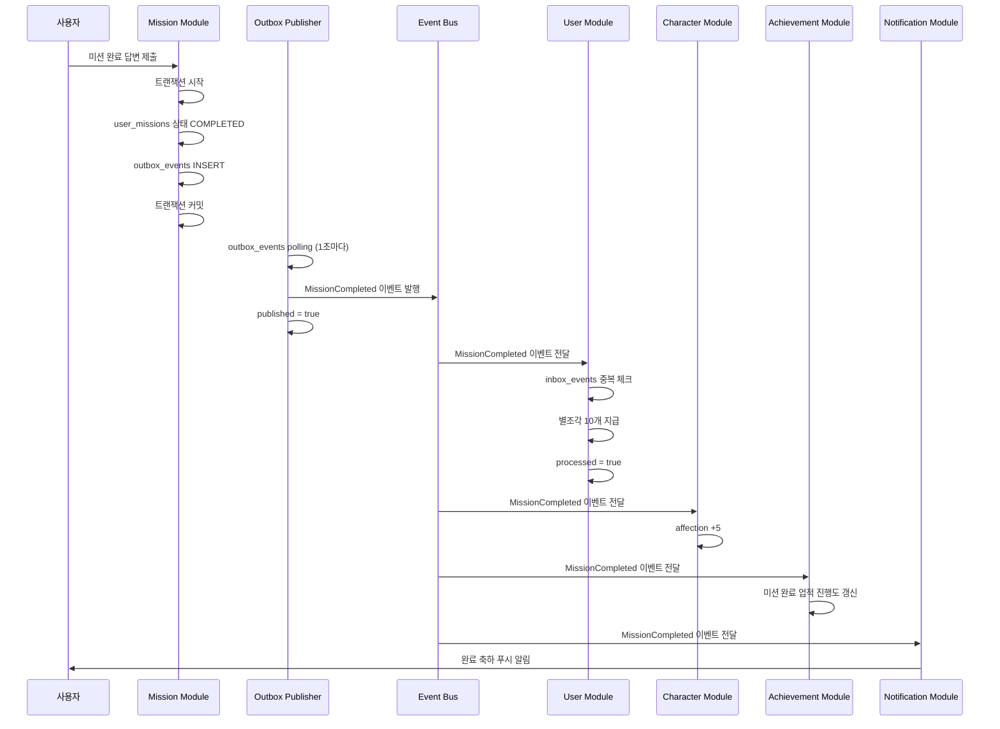
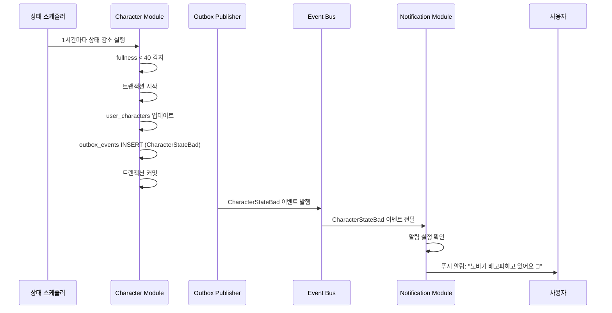
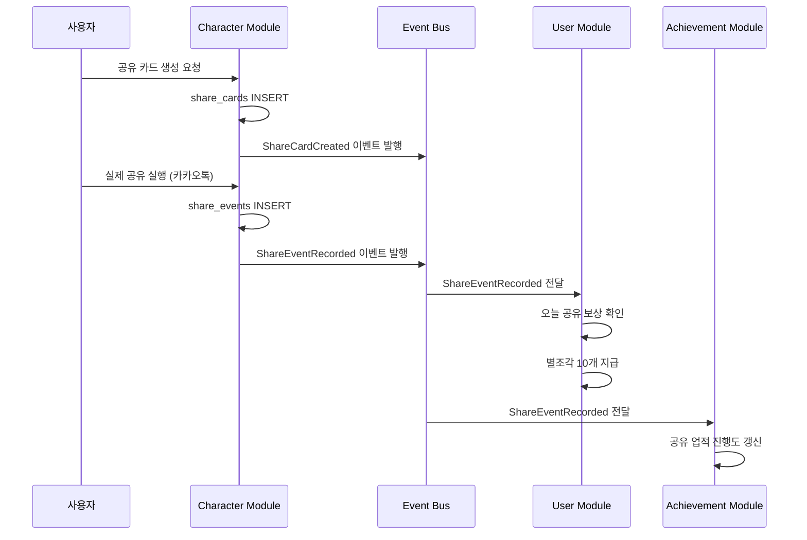

# O1. 이벤트 기반 아키텍처 설계 (선택 사항)

## 문서 정보

| 항목 | 내용 |
|------|------|
| 문서명 | Polaris 이벤트 기반 아키텍처 설계 |
| 작성일 | 2026-05-14 |
| 버전 | v1.0 |
| 목적 | 모듈 간 느슨한 결합을 위한 이벤트 기반 통신 설계 |
| 적용 시점 | MVP 이후 또는 MSA 전환 시 |
| 대상 독자 | 백엔드 개발자, 아키텍트 |

---

## ⚠️ 중요 안내

이 문서는 **선택적 확장 기능**입니다.
- **MVP 단계**: 이벤트 없이 직접 호출 방식으로 구현
- **MVP 이후**: 모듈 간 결합도를 낮추기 위해 이벤트 도입 검토

---

## 📋 목차

1. [이벤트 기반 아키텍처 개요](#이벤트-기반-아키텍처-개요)
2. [이벤트 저장소 테이블](#이벤트-저장소-테이블)
3. [이벤트 정의](#이벤트-정의)
4. [이벤트 흐름 예시](#이벤트-흐름-예시)
5. [구현 예시](#구현-예시)
6. [이벤트 관련 추가 컬럼](#이벤트-관련-추가-컬럼)

---

## 이벤트 기반 아키텍처 개요

### 왜 이벤트 기반인가?

모듈러 모놀리스에서 향후 MSA 전환을 대비하여 **모듈 간 느슨한 결합**을 유지하기 위함입니다.

#### 직접 호출 방식 (MVP)
```
Mission Module → User Module.earnStarPieces() 직접 호출
```

**문제점:**
- 모듈 간 강한 결합
- MSA 전환 시 네트워크 호출로 변경 필요
- 트랜잭션 경계 불명확

#### 이벤트 기반 방식 (MVP 이후)
```
Mission Module → MissionCompleted 이벤트 발행
User Module → 이벤트 구독 → earnStarPieces() 실행
```

**장점:**
- 모듈 간 느슨한 결합
- MSA 전환 용이
- 트랜잭션 보장 (Outbox Pattern)
- 멱등성 보장 (Inbox Pattern)

---

## 이벤트 저장소 테이블

### outbox_events (Transactional Outbox Pattern)

발행할 이벤트를 트랜잭션과 함께 저장하여 **원자성**을 보장합니다.

```sql
CREATE TABLE outbox_events (
    id BIGSERIAL PRIMARY KEY,
    aggregate_type VARCHAR(100) NOT NULL,  -- USER, CHARACTER, MISSION, ITEM 등
    aggregate_id BIGINT NOT NULL,
    event_type VARCHAR(100) NOT NULL,  -- USER_REGISTERED, MISSION_COMPLETED 등
    payload JSONB NOT NULL,
    
    -- 발행 상태
    published BOOLEAN NOT NULL DEFAULT FALSE,
    published_at TIMESTAMP,
    
    -- 재시도
    retry_count INT NOT NULL DEFAULT 0,
    last_error TEXT,
    
    created_at TIMESTAMP NOT NULL DEFAULT NOW()
);

CREATE INDEX idx_outbox_events_aggregate ON outbox_events(aggregate_type, aggregate_id);
CREATE INDEX idx_outbox_events_event_type ON outbox_events(event_type);
CREATE INDEX idx_outbox_events_published ON outbox_events(published) WHERE published = FALSE;
```

**용도:**
- 비즈니스 트랜잭션과 함께 이벤트 저장
- 별도 프로세스가 주기적으로 polling하여 이벤트 발행
- 발행 실패 시 재시도

---

### inbox_events (Idempotent Consumer Pattern)

수신한 이벤트를 저장하여 **중복 처리 방지**를 보장합니다.

```sql
CREATE TABLE inbox_events (
    id BIGSERIAL PRIMARY KEY,
    event_id VARCHAR(100) NOT NULL UNIQUE,  -- 발행자가 생성한 고유 ID
    event_type VARCHAR(100) NOT NULL,
    payload JSONB NOT NULL,
    
    -- 처리 상태
    processed BOOLEAN NOT NULL DEFAULT FALSE,
    processed_at TIMESTAMP,
    
    -- 재시도
    retry_count INT NOT NULL DEFAULT 0,
    last_error TEXT,
    
    received_at TIMESTAMP NOT NULL DEFAULT NOW()
);

CREATE INDEX idx_inbox_events_event_id ON inbox_events(event_id);
CREATE INDEX idx_inbox_events_processed ON inbox_events(processed) WHERE processed = FALSE;
CREATE INDEX idx_inbox_events_event_type ON inbox_events(event_type);
```

**용도:**
- 중복 이벤트 처리 방지 (멱등성)
- 이벤트 수신 이력 추적
- 처리 실패 시 재시도

---

## 이벤트 정의

### 1️⃣ User Module 발행 이벤트

| 이벤트 | 발행 시점 | Payload | 구독자 |
|--------|-----------|---------|--------|
| **UserRegistered** | 회원가입 완료 | userId, email, displayName, createdAt | Character, Notification |
| **UserProfileCompleted** | 온보딩 설문 완료 | userId, surveyAnswers, completedAt | Mission |
| **StarPiecesEarned** | 별조각 획득 | userId, amount, source, balance | Achievement |
| **StarPiecesSpent** | 별조각 사용 | userId, amount, source, balance | - |

#### UserRegistered 예시
```json
{
  "eventId": "uuid-1234",
  "eventType": "UserRegistered",
  "aggregateType": "USER",
  "aggregateId": 123,
  "payload": {
    "userId": 123,
    "email": "user@example.com",
    "displayName": "John Doe",
    "createdAt": "2026-05-14T10:00:00Z"
  },
  "occurredAt": "2026-05-14T10:00:00Z"
}
```

---

### 2️⃣ Character Module 발행 이벤트

| 이벤트 | 발행 시점 | Payload | 구독자 |
|--------|-----------|---------|--------|
| **CharacterCreated** | 캐릭터 생성 | userId, characterId, characterType, createdAt | Mission, Notification |
| **CharacterStateBad** | 상태 BAD 진입 | userId, characterId, stateType, stateValue | Notification |
| **CharacterStateCritical** | 상태 0 도달 | userId, characterId, stateType | Notification |
| **CharacterCared** | 돌봄 액션 실행 | userId, characterId, careType, stateAfter | - |
| **ShareCardCreated** | 공유 카드 생성 | userId, characterId, shareCardId, createdAt | Achievement |
| **ShareEventRecorded** | 공유 실행 | userId, characterId, platform, sharedAt | User (별조각 지급), Achievement |

#### CharacterStateBad 예시
```json
{
  "eventId": "uuid-5678",
  "eventType": "CharacterStateBad",
  "aggregateType": "CHARACTER",
  "aggregateId": 456,
  "payload": {
    "userId": 123,
    "characterId": 456,
    "stateType": "fullness",
    "stateValue": 35,
    "characterName": "노바"
  },
  "occurredAt": "2026-05-14T15:30:00Z"
}
```

---

### 3️⃣ Item Module 발행 이벤트

| 이벤트 | 발행 시점 | Payload | 구독자 |
|--------|-----------|---------|--------|
| **ItemPurchased** | 아이템 구매 | userId, itemId, itemType, quantity, totalPrice, purchasedAt | Achievement |
| **ItemEquipped** | 스킨/배경 장착 | userId, characterId, itemId, itemType, equippedAt | - |
| **ConsumableUsed** | 소모품 사용 | userId, characterId, itemId, usedAt | - |

---

### 4️⃣ Mission Module 발행 이벤트

| 이벤트 | 발행 시점 | Payload | 구독자 |
|--------|-----------|---------|--------|
| **MissionGenerated** | 미션 생성 | userId, missionId, templateId, generatedAt | - |
| **MissionOffered** | 미션 제안 | userId, characterId, missionId, offeredAt | Notification |
| **MissionRejected** | 미션 거절 | userId, missionId, rejectionReason, rejectedAt | - |
| **MissionCompleted** | 미션 완료 | userId, characterId, missionId, category, reward, completedAt | User (별조각), Character (affection), Achievement, Notification |
| **MissionGenerationFailed** | AI 생성 실패 | userId, templateId, errorReason, failedAt | Operation (운영 알림) |

#### MissionCompleted 예시
```json
{
  "eventId": "uuid-9012",
  "eventType": "MissionCompleted",
  "aggregateType": "MISSION",
  "aggregateId": 789,
  "payload": {
    "userId": 123,
    "characterId": 456,
    "missionId": 789,
    "category": "BASIC_ROUTINE",
    "reward": 10,
    "completedAt": "2026-05-14T16:00:00Z"
  },
  "occurredAt": "2026-05-14T16:00:00Z"
}
```

---

### 5️⃣ Notification Module 발행 이벤트

| 이벤트 | 발행 시점 | Payload | 구독자 |
|--------|-----------|---------|--------|
| **NotificationSent** | 알림 전송 성공 | userId, notificationType, sentAt | - |
| **NotificationFailed** | 알림 전송 실패 | userId, notificationType, errorMessage, failedAt | Operation |

---

### 6️⃣ Achievement Module 발행 이벤트 (MVP 이후)

| 이벤트 | 발행 시점 | Payload | 구독자 |
|--------|-----------|---------|--------|
| **AchievementCompleted** | 업적 달성 | userId, achievementId, reward, completedAt | User (별조각), Notification |

---

## 이벤트 흐름 예시

### 예시 1: 미션 완료 흐름



**단계별 설명:**

1. **Mission Module**: 미션 완료 처리
   ```java
   @Transactional
   public void completeMission(Long missionId, String answer) {
       // 1. 미션 상태 업데이트
       mission.setStatus(COMPLETED);
       missionRepository.save(mission);
       
       // 2. Outbox 이벤트 저장 (같은 트랜잭션)
       OutboxEvent event = new OutboxEvent(
           "MISSION", missionId, "MissionCompleted", payload
       );
       outboxRepository.save(event);
       
       // 트랜잭션 커밋 → 원자성 보장
   }
   ```

2. **Outbox Publisher**: 이벤트 발행
   ```java
   @Scheduled(fixedDelay = 1000)
   @Transactional
   public void publishEvents() {
       List<OutboxEvent> events = outboxRepository
           .findTop100ByPublishedFalse();
       
       for (OutboxEvent event : events) {
           eventPublisher.publish(event);
           event.setPublished(true);
           outboxRepository.save(event);
       }
   }
   ```

3. **User Module**: 별조각 지급
   ```java
   @EventListener
   @Transactional
   public void onMissionCompleted(MissionCompletedEvent event) {
       // 1. 중복 체크
       if (inboxRepository.existsByEventId(event.getEventId())) {
           return;
       }
       
       // 2. Inbox 저장
       inboxRepository.save(new InboxEvent(event));
       
       // 3. 비즈니스 로직
       starPieceService.earnStarPieces(
           event.getUserId(), 
           event.getReward(), 
           "MISSION_COMPLETION"
       );
       
       // 4. 처리 완료
       inbox.setProcessed(true);
   }
   ```

---

### 예시 2: 캐릭터 상태 악화 흐름



---

### 예시 3: 공유 보상 흐름



---

## 구현 예시

### Outbox Pattern 구현

```java
@Service
@Transactional
public class MissionService {
    
    @Autowired
    private UserMissionRepository missionRepository;
    
    @Autowired
    private OutboxEventRepository outboxRepository;
    
    public void completeMission(Long missionId, String answer) {
        // 1. 미션 완료 처리
        UserMission mission = missionRepository.findById(missionId)
            .orElseThrow();
        
        mission.setStatus(MissionStatus.COMPLETED);
        mission.setCompletionAnswer(answer);
        mission.setCompletedAt(LocalDateTime.now());
        
        missionRepository.save(mission);
        
        // 2. Outbox 이벤트 저장 (같은 트랜잭션)
        OutboxEvent event = OutboxEvent.builder()
            .aggregateType("MISSION")
            .aggregateId(mission.getId())
            .eventType("MissionCompleted")
            .payload(createMissionCompletedPayload(mission))
            .build();
        
        outboxRepository.save(event);
        
        // 트랜잭션 커밋 시 함께 저장됨 → 원자성 보장
    }
    
    private JsonNode createMissionCompletedPayload(UserMission mission) {
        return objectMapper.valueToTree(Map.of(
            "eventId", UUID.randomUUID().toString(),
            "userId", mission.getUserId(),
            "characterId", mission.getCharacterId(),
            "missionId", mission.getId(),
            "category", mission.getMissionTemplate().getCategory(),
            "reward", mission.getRewardStarPieces(),
            "completedAt", mission.getCompletedAt()
        ));
    }
}
```

---

### Outbox Publisher (별도 스케줄러)

```java
@Component
public class OutboxEventPublisher {
    
    @Autowired
    private OutboxEventRepository outboxRepository;
    
    @Autowired
    private ApplicationEventPublisher eventPublisher;
    
    @Scheduled(fixedDelay = 1000)  // 1초마다 실행
    @Transactional
    public void publishEvents() {
        // 1. 미발행 이벤트 조회 (최대 100개)
        List<OutboxEvent> unpublished = outboxRepository
            .findTop100ByPublishedFalseOrderByCreatedAtAsc();
        
        for (OutboxEvent event : unpublished) {
            try {
                // 2. Spring Events 또는 Kafka로 발행
                eventPublisher.publishEvent(toApplicationEvent(event));
                
                // 3. 발행 완료 표시
                event.setPublished(true);
                event.setPublishedAt(LocalDateTime.now());
                outboxRepository.save(event);
                
                log.info("Event published: {}", event.getId());
                
            } catch (Exception e) {
                // 4. 재시도 카운트 증가
                event.setRetryCount(event.getRetryCount() + 1);
                event.setLastError(e.getMessage());
                outboxRepository.save(event);
                
                log.error("Failed to publish event: {}", event.getId(), e);
                
                // 5. 재시도 횟수 초과 시 운영 알림
                if (event.getRetryCount() >= 5) {
                    notifyOperator(event, e);
                }
            }
        }
    }
    
    private ApplicationEvent toApplicationEvent(OutboxEvent event) {
        return switch (event.getEventType()) {
            case "MissionCompleted" -> new MissionCompletedEvent(event.getPayload());
            case "CharacterStateBad" -> new CharacterStateBadEvent(event.getPayload());
            // ... 다른 이벤트 타입
            default -> throw new IllegalArgumentException("Unknown event type: " + event.getEventType());
        };
    }
}
```

---

### Inbox Consumer (이벤트 수신)

```java
@Service
public class UserEventConsumer {
    
    @Autowired
    private InboxEventRepository inboxRepository;
    
    @Autowired
    private StarPieceService starPieceService;
    
    @EventListener
    @Transactional
    public void onMissionCompleted(MissionCompletedEvent event) {
        String eventId = event.getEventId();
        
        // 1. 중복 체크 (Idempotency)
        if (inboxRepository.existsByEventId(eventId)) {
            log.info("Event already processed: {}", eventId);
            return;
        }
        
        // 2. Inbox에 저장
        InboxEvent inbox = InboxEvent.builder()
            .eventId(eventId)
            .eventType("MissionCompleted")
            .payload(objectMapper.valueToTree(event))
            .build();
        
        inboxRepository.save(inbox);
        
        try {
            // 3. 비즈니스 로직 실행
            starPieceService.earnStarPieces(
                event.getUserId(),
                event.getReward(),
                "MISSION_COMPLETION",
                "미션 완료: " + event.getMissionId()
            );
            
            // 4. 처리 완료 표시
            inbox.setProcessed(true);
            inbox.setProcessedAt(LocalDateTime.now());
            inboxRepository.save(inbox);
            
            log.info("Event processed: {}", eventId);
            
        } catch (Exception e) {
            // 5. 재시도 카운트 증가
            inbox.setRetryCount(inbox.getRetryCount() + 1);
            inbox.setLastError(e.getMessage());
            inboxRepository.save(inbox);
            
            log.error("Failed to process event: {}", eventId, e);
            
            throw e;  // 재시도를 위해 예외 전파
        }
    }
}
```

---

## 이벤트 관련 추가 컬럼

기존 테이블에 이벤트 발행 추적을 위한 컬럼을 추가합니다.

### user_missions 테이블

```sql
ALTER TABLE user_missions 
ADD COLUMN event_published BOOLEAN NOT NULL DEFAULT FALSE;

ALTER TABLE user_missions 
ADD COLUMN event_published_at TIMESTAMP;

CREATE INDEX idx_user_missions_event_published 
ON user_missions(event_published) 
WHERE event_published = FALSE;
```

**용도:** 미션 완료 이벤트 발행 여부 추적

---

### share_events 테이블

```sql
ALTER TABLE share_events 
ADD COLUMN event_published BOOLEAN NOT NULL DEFAULT FALSE;

ALTER TABLE share_events 
ADD COLUMN event_published_at TIMESTAMP;

CREATE INDEX idx_share_events_event_published 
ON share_events(event_published) 
WHERE event_published = FALSE;
```

**용도:** 공유 이벤트 발행 여부 추적

---

### item_purchase_logs 테이블

```sql
ALTER TABLE item_purchase_logs 
ADD COLUMN event_published BOOLEAN NOT NULL DEFAULT FALSE;

ALTER TABLE item_purchase_logs 
ADD COLUMN event_published_at TIMESTAMP;

CREATE INDEX idx_item_purchase_logs_event_published 
ON item_purchase_logs(event_published) 
WHERE event_published = FALSE;
```

**용도:** 아이템 구매 이벤트 발행 여부 추적

---

## 이벤트 기반 설계의 장점

### 1. 느슨한 결합
- 모듈 간 직접 의존성 제거
- 새로운 구독자 추가 용이
- 기존 코드 수정 없이 기능 확장

### 2. 트랜잭션 보장
- Outbox Pattern으로 원자성 보장
- 이벤트 발행 실패 시 재시도
- 데이터 일관성 유지

### 3. 멱등성
- Inbox Pattern으로 중복 처리 방지
- 네트워크 장애 시에도 안전
- 재시도 가능

### 4. 확장성
- 이벤트 기반 통신으로 MSA 전환 용이
- Kafka, RabbitMQ 등 메시지 브로커 도입 가능
- 비동기 처리로 성능 향상

### 5. 추적성
- 모든 이벤트 이력 저장
- 디버깅 및 모니터링 용이
- 이벤트 소싱 패턴으로 확장 가능

---

## 이벤트 기반 설계의 단점

### 1. 복잡도 증가
- Outbox/Inbox 테이블 관리 필요
- 이벤트 발행/구독 로직 추가
- 디버깅 어려움 (비동기)

### 2. 최종 일관성
- 즉시 일관성이 아닌 최종 일관성
- 이벤트 처리 지연 가능
- 사용자 경험 고려 필요

### 3. 운영 부담
- 이벤트 모니터링 필요
- 실패 이벤트 재처리
- 데이터 정합성 검증

---

## MVP vs 이벤트 기반 비교

| 구분 | MVP (직접 호출) | 이벤트 기반 |
|------|-----------------|-------------|
| 구현 복잡도 | 낮음 | 높음 |
| 모듈 결합도 | 높음 | 낮음 |
| 트랜잭션 | 단순 | 복잡 (Outbox/Inbox) |
| 성능 | 빠름 (동기) | 느림 (비동기) |
| MSA 전환 | 어려움 | 쉬움 |
| 디버깅 | 쉬움 | 어려움 |
| 확장성 | 낮음 | 높음 |

---

## 권장 적용 시점

### MVP 단계
- ❌ 이벤트 기반 **미적용**
- ✅ 직접 호출 방식으로 빠른 구현
- ✅ 모듈 간 인터페이스만 명확히 정의

### MVP 이후
- ✅ 이벤트 기반 **적용 검토**
- ✅ 트래픽 증가 시
- ✅ MSA 전환 준비 시
- ✅ 모듈 간 결합도 문제 발생 시

---

## 참고 자료

- [Transactional Outbox Pattern](https://microservices.io/patterns/data/transactional-outbox.html)
- [Idempotent Consumer Pattern](https://microservices.io/patterns/communication-style/idempotent-consumer.html)
- [Event-Driven Architecture](https://martinfowler.com/articles/201701-event-driven.html)

---

**문서 작성 완료일**: 2026-05-14
